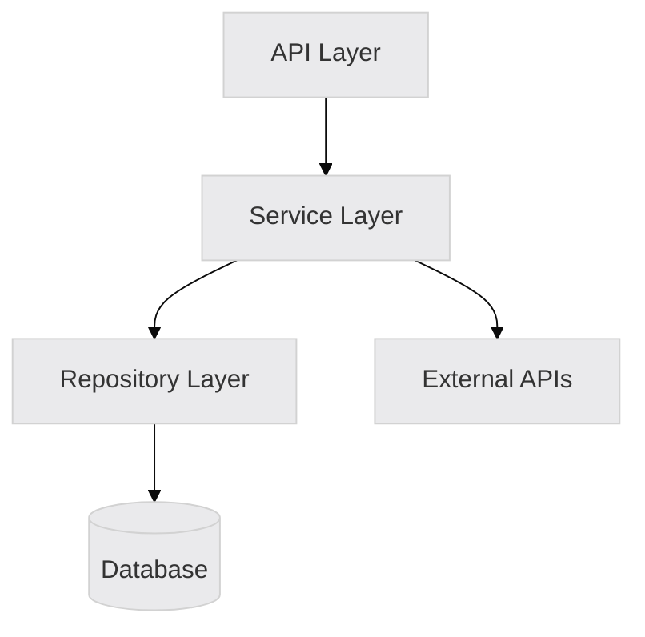

# Architecture Review

You are tasked with conducting a comprehensive architecture review of the codebase. This review analyzes architectural patterns, anti-patterns, scalability characteristics, and provides prioritized recommendations.

<review_scope>
$ARGUMENTS
</review_scope>

## Initial Setup

When this command is invoked:

1. **If a scope was provided** (specific module, feature, or area):
   - Focus the review on that area
   - Still consider dependencies and interactions with other parts

2. **If no scope provided**:
   - Conduct a full codebase architecture review
   - Prioritize findings by impact and severity

## Process Steps

### Step 1: Load Reference Materials

Read the system design reference materials to inform your analysis:

```
Read: .claude/docs/system-design/patterns-catalog.md
Read: .claude/docs/system-design/anti-patterns-catalog.md
Read: .claude/docs/system-design/scalability-checklist.md
```

These provide pattern definitions, detection heuristics, and assessment criteria.

### Step 2: Parallel Agent Analysis

Spawn multiple specialized agents to analyze different architectural aspects concurrently:

**Agent 1: Pattern Detection**
Use the `architecture-pattern-detector` agent:
```
Analyze the codebase [scope if specified] to identify:
1. Primary architectural pattern(s) in use
2. Secondary patterns (repository, factory, etc.)
3. Layer violations or inconsistencies
4. Dependency direction analysis

Reference patterns from .claude/docs/system-design/patterns-catalog.md
Provide file:line evidence for all findings.
```

**Agent 2: Anti-Pattern Detection**
Use the `architecture-pattern-detector` agent:
```
Analyze the codebase [scope if specified] to identify anti-patterns:
1. God objects/classes (>500 lines, many responsibilities)
2. Distributed monolith symptoms (if microservices)
3. Tight coupling and circular dependencies
4. Code duplication and missing abstractions

Reference anti-patterns from .claude/docs/system-design/anti-patterns-catalog.md
Provide file:line evidence for all findings.
```

**Agent 3: Scalability Assessment**
Use the `scalability-assessor` agent:
```
Analyze the codebase [scope if specified] for scalability:
1. Database patterns and potential bottlenecks
2. Connection pool and resource configurations
3. Single points of failure
4. Horizontal scaling blockers (state, sessions, files)
5. External service resilience (timeouts, circuit breakers)

Reference .claude/docs/system-design/scalability-checklist.md
Provide file:line evidence for all findings.
```

### Step 3: Wait and Synthesize

**IMPORTANT**: Wait for ALL agents to complete before proceeding.

Compile findings into a cohesive analysis:
- Cross-reference pattern detection with anti-pattern findings
- Connect scalability issues to architectural decisions
- Identify root causes vs symptoms
- Prioritize by impact and fix effort

### Step 4: Generate Review Document

Detect username for file naming:
```bash
if [ -f ".claude/config.yaml" ]; then
    CONFIG_USERNAME=$(grep "^username:" .claude/config.yaml | cut -d: -f2 | tr -d ' ' | tr '[:upper:]' '[:lower:]')
fi
RPI_USERNAME="${CONFIG_USERNAME:-${RPI_USERNAME:-$(git config user.name | tr ' ' '-' | tr '[:upper:]' '[:lower:]')}}"
RPI_USERNAME="${RPI_USERNAME:-user}"
CURRENT_DATE=$(date +%Y.%m.%d)
```

Create the document at `thoughts/reviews/YYYY.MM.DD-{username}-architecture-review.md`:

```markdown
---
date: [ISO datetime]
reviewer: [name]
repository: [repo name]
branch: [current branch]
scope: [review scope or "full codebase"]
type: architecture-review
status: complete
---

# Architecture Review: [Repository/Scope]

**Date:** [ISO datetime]
**Reviewer:** [name]
**Scope:** [what was reviewed]

## Executive Summary

[2-3 paragraph summary of architectural health, key strengths, and primary concerns]

### Overall Assessment: [Good/Fair/Poor]

| Dimension | Rating | Notes |
|-----------|--------|-------|
| Pattern Clarity | ⭐⭐⭐⭐☆ | [brief note] |
| Code Organization | ⭐⭐⭐☆☆ | [brief note] |
| Scalability Readiness | ⭐⭐☆☆☆ | [brief note] |
| Maintainability | ⭐⭐⭐⭐☆ | [brief note] |

## Architectural Patterns

### Primary Pattern: [Pattern Name]
**Confidence:** High/Medium/Low

**Evidence:**
- `src/controllers/` - Presentation layer
- `src/services/` - Business logic layer
- `src/repositories/` - Data access layer

**Assessment:**
[How well is this pattern implemented? Any gaps?]

### Secondary Patterns
| Pattern | Location | Purpose |
|---------|----------|---------|
| Repository | `src/repositories/` | Data access abstraction |
| Factory | `src/factories/` | Object creation |

### Architecture Diagram



## Anti-Patterns Detected

### Critical Issues

#### 1. [Anti-Pattern Name]: [Location]
**Severity:** Critical
**File:** `path/to/file.ts:line`

**Description:**
[What the issue is and why it's problematic]

**Evidence:**
```typescript
// Code example showing the issue
```

**Impact:**
- [Impact 1]
- [Impact 2]

**Recommendation:**
[How to fix it]

### Medium Issues

#### 2. [Anti-Pattern Name]: [Location]
**Severity:** Medium
[Same structure as above]

### Minor Issues

[List minor issues briefly]

## Scalability Assessment

### Current Capacity

| Component | Configuration | Limit | Utilization |
|-----------|---------------|-------|-------------|
| Database | PostgreSQL | Single | Unknown |
| Cache | N/A | N/A | N/A |
| Queue | N/A | N/A | N/A |

### Bottlenecks

#### 1. [Bottleneck Name]
**Location:** `file:line`
**Severity:** High/Medium/Low
**Impact:** [What breaks and when]
**Fix:** [How to resolve]

### Single Points of Failure

| Component | Risk | Mitigation |
|-----------|------|------------|
| Database | High | Add read replica |
| [Other] | | |

### Horizontal Scaling Readiness

| Dimension | Ready | Blockers |
|-----------|-------|----------|
| Compute | No | In-memory sessions |
| Database | Partial | No read replicas |
| Storage | No | Local file system |

## Dependency Analysis

### Layer Dependencies

```
┌─────────────────┐
│   Controllers   │ → only imports services ✓
└────────┬────────┘
         │
┌────────▼────────┐
│    Services     │ → imports repos, external ✓
└────────┬────────┘
         │
┌────────▼────────┐
│  Repositories   │ → only imports DB ✓
└─────────────────┘
```

### Layer Violations

| From | To | Location | Severity |
|------|-----|----------|----------|
| [Layer] | [Layer] | `file:line` | High |

### Circular Dependencies

[List any circular dependencies found]

## Recommendations

### Priority Matrix

| Priority | Issue | Solution | Effort | Impact |
|----------|-------|----------|--------|--------|
| 1 | [Issue] | [Solution] | Low/Med/High | High |
| 2 | [Issue] | [Solution] | Low/Med/High | Medium |

### Quick Wins (< 1 day)

1. **[Issue]** - [Solution] - `file:line`
2. **[Issue]** - [Solution] - `file:line`

### Medium-Term (1-2 weeks)

1. **[Issue]** - [Solution]
2. **[Issue]** - [Solution]

### Long-Term (> 2 weeks)

1. **[Issue]** - [Solution]
2. **[Issue]** - [Solution]

## What's Working Well

[Highlight positive architectural decisions and patterns that should be preserved]

1. **[Good Practice]** - [Why it's good]
2. **[Good Practice]** - [Why it's good]

## Next Steps

1. [ ] [First action item]
2. [ ] [Second action item]
3. [ ] [Third action item]

## Appendix

### Files Analyzed
[List of key files analyzed]

### Agent Outputs
[Summarized outputs from each agent]
```

### Step 5: Present Summary

Present a concise summary to the user:
- Key findings (top 3-5 issues)
- Overall health assessment
- Most impactful recommendation
- Location of full report

## Important Notes

- **Evidence-based**: Every finding must have file:line references
- **Prioritized**: Focus on high-impact issues first
- **Actionable**: Recommendations should be specific and achievable
- **Balanced**: Acknowledge what's working well, not just problems
- **Context-aware**: Consider team size, project maturity, scale requirements

## Success Indicators

Good architecture reviews:
- Identify root causes, not just symptoms
- Provide clear priority order
- Include specific code references
- Offer practical remediation paths
- Balance criticism with positive observations
