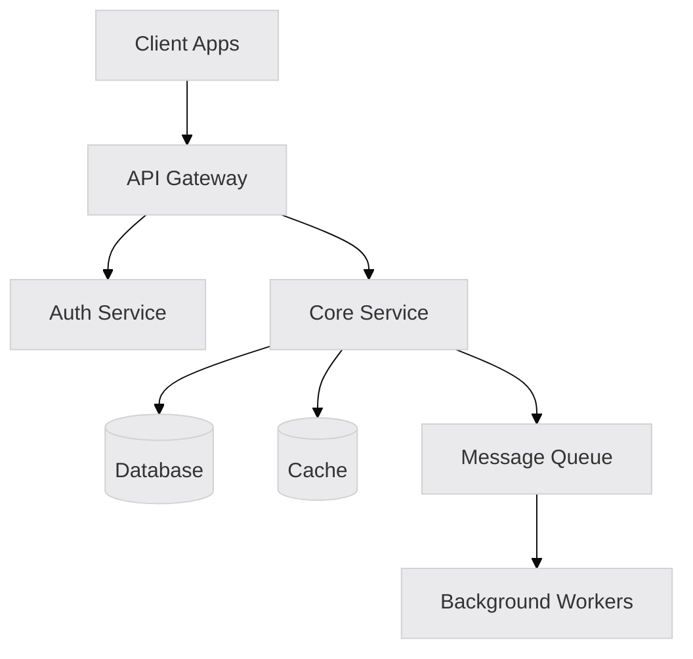
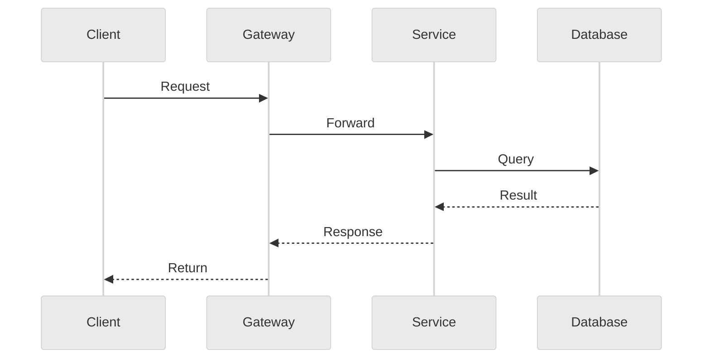
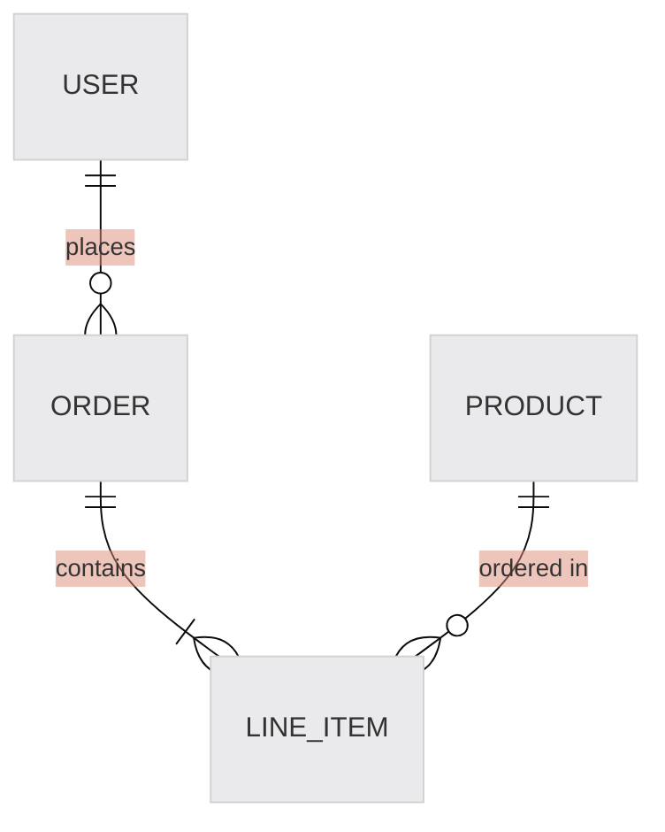

# Design System

You are tasked with facilitating an interactive system design session. This command guides through requirements gathering, component design, and tradeoff analysis to produce a comprehensive design document.

<design_request>
$ARGUMENTS
</design_request>

## Initial Setup

When this command is invoked:

1. **If a design request was provided**:
   - Acknowledge the request
   - Proceed to Step 1 to clarify requirements

2. **If no request provided**, respond with:
```
I'm ready to help design a system. Please describe:
- What system or feature you want to design
- Any known requirements or constraints
- The problem you're trying to solve
```

Then wait for the user's response.

## Process Steps

### Step 1: Load Reference Materials

Read the system design references to inform the session:

```
Read: .claude/docs/system-design/patterns-catalog.md
Read: .claude/docs/system-design/tradeoff-decision-trees.md
Read: .claude/docs/system-design/non-functional-requirements.md
```

### Step 2: Requirements Clarification

Gather requirements interactively using AskUserQuestion. Ask about:

**Functional Requirements:**
- What are the core use cases?
- Who are the users/actors?
- What are the key workflows?

**Non-Functional Requirements** (reference NFR guide):
- **Performance:** What response times are acceptable?
- **Scale:** How many users? How much data?
- **Availability:** What uptime is required?
- **Security:** Authentication needs? Data sensitivity?

**Constraints:**
- Existing technology stack?
- Team expertise?
- Budget/timeline constraints?
- Integration requirements?

**Question Framework:**
Ask questions ONE AT A TIME, preferring multiple choice:

```
What scale are you designing for?
(A) Small - < 1,000 users, single region
(B) Medium - 1,000-100,000 users, potential for growth
(C) Large - 100,000+ users, multi-region
(D) Unknown - let's figure it out
```

```
What are your consistency requirements?
(A) Strong consistency - users must see latest data immediately
(B) Eventual consistency - slight delays acceptable
(C) Mixed - some operations need strong, others can be eventual
(D) Not sure - help me decide
```

**Skip questions if:**
- User provided detailed requirements document
- Information is obvious from context
- Asking would be redundant

### Step 3: Pattern Identification

Based on gathered requirements, identify relevant architectural patterns:

1. **Primary pattern candidates** from patterns-catalog.md
2. **Supporting patterns** that complement the primary
3. **Anti-patterns to avoid** based on requirements

Present options to user:
```
Based on your requirements, I recommend:

**Primary Pattern: [Pattern Name]**
Reason: [Why this fits]

**Alternative: [Other Pattern]**
Would work if: [Conditions]

Do you want me to proceed with [Pattern Name], or would you like to explore alternatives?
```

### Step 4: Component Design

Design the system components:

1. **High-level architecture**
   - Major components and their responsibilities
   - Communication patterns between components
   - Data flow through the system

2. **Component breakdown**
   - Each component's purpose
   - Interfaces between components
   - Data each component owns

3. **Technology recommendations**
   - Specific technologies for each component
   - Rationale for choices
   - Alternatives considered

### Step 5: Tradeoff Analysis

For key decisions, conduct explicit tradeoff analysis:

**If research needed**, spawn `tradeoff-researcher` agent:
```
Research the tradeoff between [Option A] and [Option B] for [context].
Consider: [specific requirements from this design]
Return: Recommendation with rationale
```

Present tradeoffs to user:
```
**Decision: [Description]**

| Factor | Option A | Option B |
|--------|----------|----------|
| [Factor 1] | [Rating] | [Rating] |
| [Factor 2] | [Rating] | [Rating] |

**Recommendation:** [Option] because [reason]

Does this align with your priorities?
```

### Step 6: Generate Design Document

Detect username for file naming:
```bash
if [ -f ".claude/config.yaml" ]; then
    CONFIG_USERNAME=$(grep "^username:" .claude/config.yaml | cut -d: -f2 | tr -d ' ' | tr '[:upper:]' '[:lower:]')
fi
RPI_USERNAME="${CONFIG_USERNAME:-${RPI_USERNAME:-$(git config user.name | tr ' ' '-' | tr '[:upper:]' '[:lower:]')}}"
RPI_USERNAME="${RPI_USERNAME:-user}"
CURRENT_DATE=$(date +%Y.%m.%d)
```

Create document at `thoughts/research/YYYY.MM.DD-{username}-{system-name}-design.md`:

```markdown
---
date: [ISO datetime]
designer: [name]
system: [system name]
status: draft
type: system-design
---

# System Design: [System Name]

**Date:** [ISO datetime]
**Designer:** [name]
**Status:** Draft - Pending Review

## Overview

### Problem Statement
[What problem does this system solve?]

### Goals
1. [Primary goal]
2. [Secondary goal]
3. [Tertiary goal]

### Non-Goals
[What this system explicitly does NOT do]

## Requirements

### Functional Requirements
| ID | Requirement | Priority |
|----|-------------|----------|
| FR1 | [Requirement] | Must |
| FR2 | [Requirement] | Should |

### Non-Functional Requirements
| Category | Requirement | Target |
|----------|-------------|--------|
| Performance | Response time | < 200ms p95 |
| Scale | Concurrent users | 10,000 |
| Availability | Uptime | 99.9% |
| Security | Authentication | OAuth 2.0 |

### Constraints
- [Constraint 1]
- [Constraint 2]

## Architecture

### High-Level Diagram



### Architectural Pattern
**Pattern:** [Pattern Name]
**Rationale:** [Why this pattern]

### Components

#### 1. [Component Name]
**Responsibility:** [What it does]
**Technology:** [Tech choice]
**Interfaces:**
- Input: [What it receives]
- Output: [What it produces]

#### 2. [Component Name]
[Same structure]

### Data Flow



## Data Model

### Entities

#### [Entity Name]
```
{
  id: string (UUID)
  [field]: [type]
  created_at: timestamp
  updated_at: timestamp
}
```

### Relationships


## API Design

### Endpoints

| Method | Path | Description |
|--------|------|-------------|
| GET | /api/v1/[resource] | List resources |
| POST | /api/v1/[resource] | Create resource |
| GET | /api/v1/[resource]/:id | Get resource |

### Example Request/Response

```json
// POST /api/v1/[resource]
// Request
{
  "field": "value"
}

// Response
{
  "id": "uuid",
  "field": "value",
  "created_at": "ISO8601"
}
```

## Technology Decisions

### Decision: [Technology Choice]

| Option | Pros | Cons |
|--------|------|------|
| [Option A] | [Pros] | [Cons] |
| [Option B] | [Pros] | [Cons] |

**Decision:** [Choice]
**Rationale:** [Why]
**Reversibility:** [Easy/Medium/Hard]

## Scalability Considerations

### Horizontal Scaling
- [Component] scales by [method]
- [Component] scales by [method]

### Bottleneck Analysis
| Component | Bottleneck | Mitigation |
|-----------|------------|------------|
| Database | Connections | Connection pooling |
| [Other] | [Issue] | [Solution] |

### Capacity Estimates
| Metric | Current | Year 1 | Year 3 |
|--------|---------|--------|--------|
| Users | N/A | [Est] | [Est] |
| Requests/sec | N/A | [Est] | [Est] |
| Storage | N/A | [Est] | [Est] |

## Security Considerations

### Authentication
[How users authenticate]

### Authorization
[How permissions work]

### Data Protection
- Encryption at rest: [Yes/No - Method]
- Encryption in transit: [Yes/No - Method]
- PII handling: [Approach]

## Monitoring & Observability

### Key Metrics
- [Metric 1]: [What it measures]
- [Metric 2]: [What it measures]

### Alerting
| Condition | Threshold | Action |
|-----------|-----------|--------|
| Error rate | > 1% | Page on-call |
| Latency p99 | > 1s | Alert |

## Failure Scenarios

### [Failure Scenario 1]
**Impact:** [What breaks]
**Detection:** [How we know]
**Mitigation:** [What happens automatically]
**Recovery:** [Manual steps if needed]

## Implementation Plan

### Phase 1: [Name]
- [ ] [Task 1]
- [ ] [Task 2]

### Phase 2: [Name]
- [ ] [Task 1]
- [ ] [Task 2]

## Open Questions

- [ ] [Question 1]
- [ ] [Question 2]

## References

- [Link to relevant documentation]
- [Link to similar systems]
```

### Step 7: Review and Iterate

Present the design document summary and ask:
```
I've created the design document at: thoughts/research/YYYY.MM.DD-{username}-{system-name}-design.md

Key decisions:
1. [Decision 1]
2. [Decision 2]

Would you like to:
(A) Review and refine any section
(B) Dive deeper into a specific component
(C) Proceed to implementation planning (/plan)
(D) Export for team review
```

## Important Notes

- **Interactive process**: Don't design in isolation - involve the user
- **Document decisions**: Capture WHY, not just WHAT
- **Include alternatives**: Show what was considered and rejected
- **Be realistic**: Design for actual requirements, not hypothetical scale
- **Iterate**: Good design is refined, not created perfect

## Success Indicators

Good design documents:
- Answer "why" for every major decision
- Have clear, testable requirements
- Include diagrams for complex interactions
- Consider failure modes
- Provide implementation guidance
