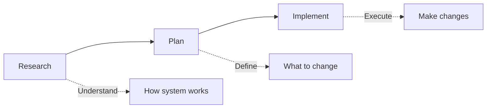

# Advanced Context Engineering for AI-Driven Development

A complete implementation of the three-phase workflow (Research → Plan → Implement) for maximizing AI coding agent effectiveness, based on the methodology presented in "Advanced Context Engineering for Coding Agents".

## 🎯 Overview

This system transforms how you work with AI coding assistants by introducing a structured, context-efficient workflow that produces production-ready code without the typical back-and-forth "shouting matches" with AI.

### The Problem This Solves
- **Context overflow** - Running out of context before completing tasks
- **Code slop** - AI generating code that doesn't match existing patterns
- **Misunderstandings** - AI not understanding the codebase structure
- **Inefficiency** - Repeated corrections and regenerations
- **Review difficulty** - Hard to review massive AI-generated PRs

### The Solution: Three-Phase Workflow



## 🚀 Quick Start

### Installation

1. **Copy the `.claude` directory to your project root:**
```bash
cp -r /path/to/maximal-ai/.claude /path/to/your/project/
```

2. **Create document directories:**
```bash
mkdir -p research plans
```

3. **Copy the CLAUDE.md configuration:**
```bash
cp /path/to/maximal-ai/CLAUDE.md /path/to/your/project/
```

### Basic Usage

#### 1. Research Phase
```
/research How does the authentication system work in this codebase?
```
This will:
- Spawn parallel agents to explore the codebase
- Find relevant files and patterns
- Trace data flow and dependencies
- Generate a comprehensive research document

#### 2. Planning Phase
```
/plan research/2025-01-08-authentication-flow.md
```
Or start fresh:
```
/plan I need to add OAuth support to the authentication system
```
This will:
- Analyze the current implementation
- Create a phased implementation plan
- Define specific changes with code examples
- Include verification criteria

#### 3. Implementation Phase
```
/implement plans/2025-01-08-add-oauth-support.md
```
This will:
- Execute the plan phase by phase
- Verify each step before proceeding
- Update progress tracking
- Adapt to reality while maintaining plan intent

## 📁 Project Structure

```
your-project/
├── .claude/
│   ├── commands/
│   │   ├── research.md      # Research phase command
│   │   ├── plan.md          # Planning phase command
│   │   └── implement.md     # Implementation phase command
│   └── agents/
│       ├── codebase-locator.md        # Finds WHERE things are
│       ├── codebase-analyzer.md       # Understands HOW code works
│       ├── codebase-pattern-finder.md # Discovers patterns to follow
│       └── web-search-researcher.md   # External documentation research
├── research/                 # Generated research documents
│   └── YYYY-MM-DD-topic.md
├── plans/                    # Generated implementation plans
│   └── YYYY-MM-DD-feature.md
└── CLAUDE.md                 # Project configuration for Claude
```

## 🔄 Workflow Details

### Phase 1: Research

**Purpose:** Understand the existing system before making changes.

**Key Activities:**
- Locate relevant files and components
- Analyze current implementation
- Trace data flow and dependencies
- Identify patterns and conventions

**Output:** Research document with:
- Summary of findings
- Detailed component analysis
- Code references with file:line numbers
- Architecture insights
- Open questions

**Example Research Document Structure:**
```markdown
# Research: Authentication System

## Summary
[High-level overview of findings]

## Detailed Findings
### Authentication Flow
- `src/auth/login.ts:45` - Login endpoint
- `src/auth/jwt.ts:23` - Token generation
[...]

## Architecture Insights
[Patterns and conventions discovered]

## Open Questions
[Areas needing clarification]
```

### Phase 2: Planning

**Purpose:** Define exactly what changes to make before coding.

**Key Activities:**
- Review research findings
- Design solution approach
- Break into implementation phases
- Define verification criteria
- Identify what NOT to do

**Output:** Implementation plan with:
- Overview and approach
- Phased implementation steps
- Specific code changes
- Success criteria (automated & manual)
- Testing strategy

**Example Plan Structure:**
```markdown
# OAuth Support Implementation Plan

## Overview
[What we're building and why]

## Phase 1: Add OAuth Provider Configuration
### Changes Required:
1. **File**: `config/auth.ts`
   **Changes**: Add OAuth provider settings
   ```typescript
   // Code to add
   ```

### Success Criteria:
#### Automated Verification:
- [ ] Tests pass: `npm test`
- [ ] Lint passes: `npm run lint`

#### Manual Verification:
- [ ] OAuth flow works in browser
[...]
```

### Phase 3: Implementation

**Purpose:** Execute the plan with verification at each step.

**Key Activities:**
- Follow plan phase by phase
- Make specified changes
- Run verification after each phase
- Update progress tracking
- Adapt to reality as needed

**Progress Tracking:**
- Plan checkboxes updated as completed
- TodoWrite list maintained
- Issues documented and resolved

## 🎯 Best Practices

### Context Management
1. **Keep context under 40%** - Monitor and manage context usage
2. **Use parallel agents** - Research multiple aspects simultaneously
3. **Intentional compaction** - Focus on what matters most
4. **Read files fully** - Never use partial file reading

### Research Phase
- Spawn multiple specialized agents in parallel
- Always verify findings with actual code
- Include concrete file:line references
- Think about architectural implications

### Planning Phase
- Be skeptical and thorough
- Work iteratively with feedback
- No unresolved questions in final plan
- Include "What we're NOT doing"
- Separate automated vs manual verification

### Implementation Phase
- Follow plan intent, adapt to reality
- Verify continuously, not at the end
- Update progress tracking regularly
- Document any deviations from plan

## 🛠 Advanced Features

### Custom Agents

You can add specialized agents for your domain:

```markdown
---
name: database-migrator
description: Specializes in database schema changes and migrations
tools: Read, Bash, Edit
---

[Agent instructions...]
```

### Workflow Customization

Extend commands for your specific needs:
- Add domain-specific research patterns
- Include company coding standards
- Integrate with your CI/CD pipeline
- Add custom verification steps

## 📊 Success Metrics

### You Know It's Working When:
- ✅ Research answers questions completely
- ✅ Plans are approved with minimal revision
- ✅ Implementation proceeds without blocking
- ✅ Tests pass on first run
- ✅ Code follows existing patterns
- ✅ No repeated corrections needed
- ✅ Context stays under 40%

### Common Anti-Patterns to Avoid:
- ❌ Skipping research and jumping to coding
- ❌ Creating plans with open questions
- ❌ Implementing multiple phases without verification
- ❌ Ignoring existing patterns
- ❌ Not tracking progress
- ❌ Letting context overflow

## 🔍 Troubleshooting

### "Context Overflow"
**Solution:** Use more focused sub-agents, implement intentional compaction

### "Agent Doesn't Understand Codebase"
**Solution:** Ensure research phase is thorough, read key files fully

### "Plan Doesn't Match Reality"
**Solution:** Re-run targeted research, update plan before implementing

### "Tests Failing After Implementation"
**Solution:** Verify each phase separately, don't accumulate issues

## 📚 Theory & Background

### Why Three Phases?

The hierarchy of impact on code quality:
- **Bad research line** → Thousands of bad code lines
- **Bad plan line** → Hundreds of bad code lines  
- **Bad code line** → One bad code line

By catching issues early in research and planning, we prevent cascading errors in implementation.

### Context Engineering Principles

1. **LLMs are pure functions** - Output quality depends on input context
2. **Context is finite** - Must be actively managed
3. **Parallel processing** - Use specialized agents concurrently
4. **Incremental verification** - Test continuously, not at end
5. **Human review at right level** - Review plans, not massive PRs

## 🤝 Contributing

This workflow is continuously evolving. Contributions welcome:
- Additional specialized agents
- Industry-specific patterns
- Integration examples
- Success stories

## 📖 References

- [Original Talk: Advanced Context Engineering for Coding Agents](https://youtu.be/IS_y40zY-hc)
- [Human Layer Repository](https://github.com/humanlayer/humanlayer)
- [AI That Works Examples](https://github.com/dexhorthy/ai-that-works)

## 🎓 Key Takeaways

1. **Research prevents bad code** - Understanding before coding saves time
2. **Plans are easier to review** - Review intent, not implementation
3. **Context management is critical** - Stay under 40% for best results
4. **Parallel agents maximize efficiency** - Research broadly, implement narrowly
5. **Verification prevents accumulation** - Fix issues immediately

---

*Remember: The goal isn't just to write code with AI, but to write the RIGHT code efficiently with minimal context usage and maximum correctness.*