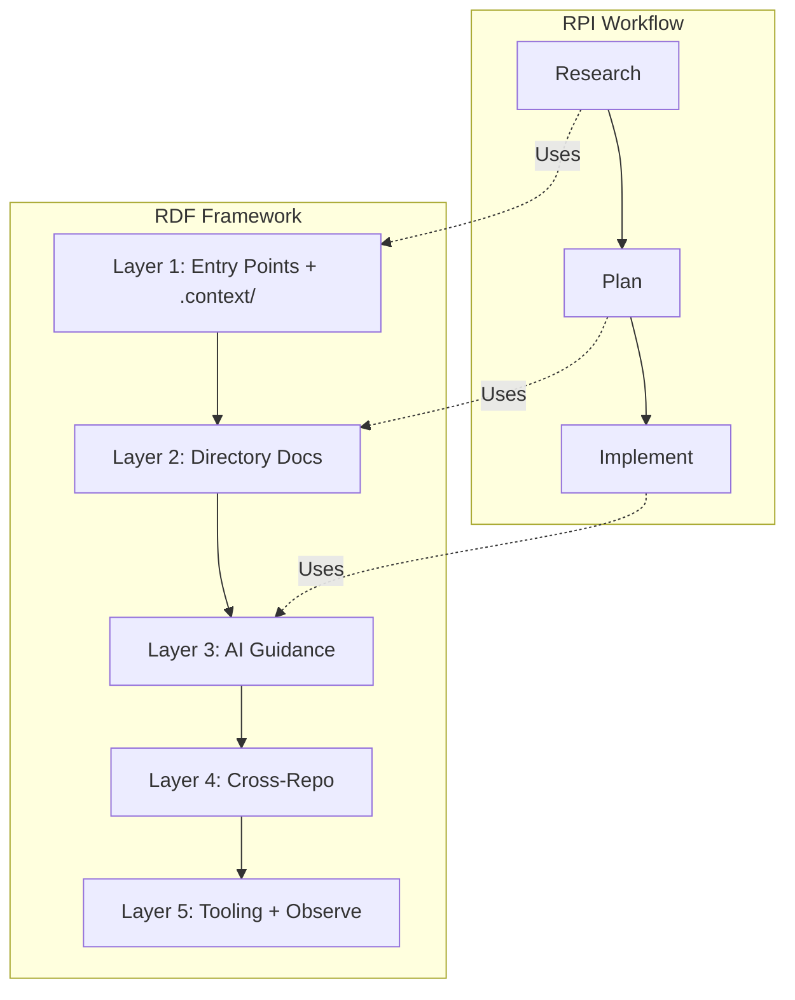
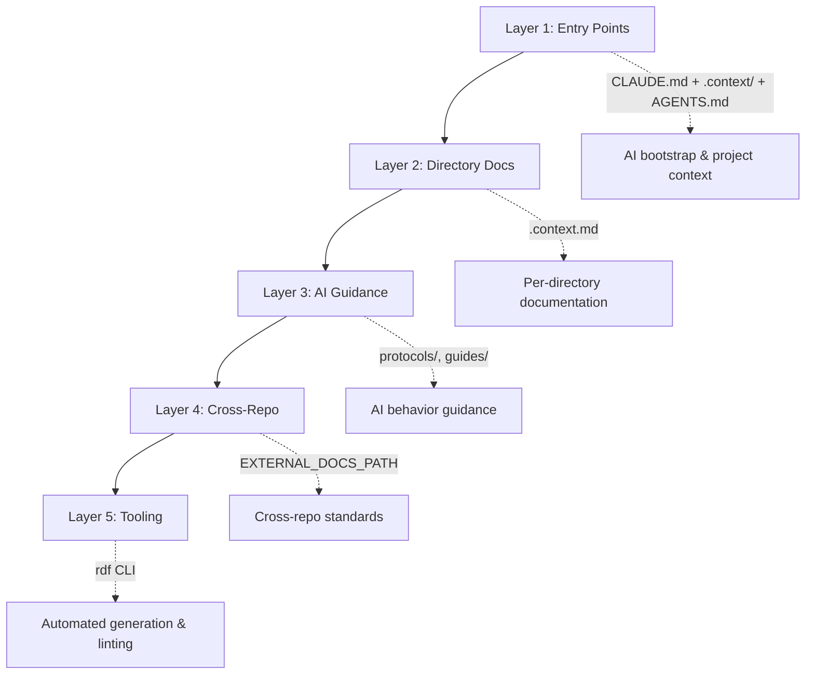

# Maximal AI - Modular AI Development Toolkit

A comprehensive toolkit for maximizing AI coding agent effectiveness, featuring two complementary frameworks:

- **RPI Workflow** (Research → Plan → Implement) - Three-phase development workflow
- **RDF Framework** (Repo Documentation Framework) - Layer-based AI-friendly documentation

Based on the methodology from ["Advanced Context Engineering for Coding Agents"](https://youtu.be/IS_y40zY-hc).

## 🎯 Overview

This toolkit transforms how you work with AI coding assistants through structured workflows and comprehensive documentation that helps AI understand your codebase.

### The Problems This Solves
- **Context overflow** - Running out of context before completing tasks
- **Code slop** - AI generating code that doesn't match existing patterns
- **Misunderstandings** - AI not understanding the codebase structure
- **Inefficiency** - Repeated corrections and regenerations
- **Review difficulty** - Hard to review massive AI-generated PRs
- **Documentation gaps** - AI can't find relevant context in undocumented code

### Two Complementary Solutions


```mermaid
graph TB
    subgraph "RPI Workflow"
        A[Research] --> B[Plan]
        B --> C[Implement]
    end

    subgraph "RDF Framework"
        D[Layer 1: Entry Points + .context/]
        E[Layer 2: Directory Docs]
        F[Layer 3: AI Guidance]
        G[Layer 4: Cross-Repo]
        H[Layer 5: Tooling + Observe]
        D --> E --> F --> G --> H
    end

    A -.->|Uses| D
    B -.->|Uses| E
    C -.->|Uses| F
```

## 📋 Prerequisites

Before installing, ensure you have the following:

| Requirement | Version | Check Command |
|-------------|---------|---------------|
| **Git** | 2.0+ | `git --version` |
| **Bash** | 4.0+ | `bash --version` |
| **Python** | 3.10+ | `python --version` |
| **jq** | 1.5+ | `jq --version` |

**Optional tools** (for enhanced functionality):
- **Node.js/npm** - For JavaScript/TypeScript formatting (prettier)
- **Ruff** - For Python formatting and linting (`pip install ruff`)
- **pytest** - For Python test running (`pip install pytest`)

**Note:** If optional tools are not installed, the hooks will gracefully skip those features without errors.

## 🚀 Quick Start

### One-Time Setup

1. **Clone this repository:**
```bash
git clone https://github.com/YOUR_USERNAME/maximal-ai.git /path/to/maximal-ai
```

2. **Add to your shell configuration** (`~/.zshrc` or `~/.bashrc`):
```bash
export MAXIMAL_AI_HOME="$HOME/path-to-maximal-ai/maximal-ai"
export PATH="$HOME/.local/bin:$PATH"
```

3. **Run the installer:**
```bash
cd /path/to/maximal-ai
./install.sh
```

4. **Reload your shell:**
```bash
source ~/.zshrc  # or source ~/.bashrc
```

### Install to Any Project

Once set up, you can install frameworks into any project using subcommands:

```bash
cd /path/to/your/project

# Interactive mode - choose what to install
maximal-ai

# Install RPI workflow only (Research → Plan → Implement)
maximal-ai rpi-workflow

# Install RDF framework only (documentation layers)
maximal-ai rdf-framework -l 1,2,3

# Install both frameworks
maximal-ai complete
```

#### RPI Workflow Installation

`maximal-ai rpi-workflow` installs:
- ✅ 8 commands (research, plan, implement, epic-oneshot, standup, blocked, create_handoff, resume_handoff)
- ✅ 7 specialized agents
- ✅ Username configuration for RPI file naming
- ✅ `.claude/config.yaml` with your username
- ✅ `thoughts/` directory structure (research/, plans/, handoffs/)
- ✅ CLAUDE.md configuration
- ✅ Auto-detect coding standards from `docs/coding-standards/`

#### RDF Framework Installation

`maximal-ai rdf-framework` installs documentation layers:
- **Layer 1**: Entry Points (CLAUDE.md with AI bootstrap, `.context/` directory, docs/AGENTS.md, .repomap.yaml)
- **Layer 2**: Directory Docs (`.context.md` files in source directories)
- **Layer 3**: AI Guidance (protocols/, checklists/, guides/)
- **Layer 4**: Cross-Repo (external docs linkage via `$EXTERNAL_DOCS_PATH`)
- **Layer 5**: Tooling (`rdf` CLI, linters, observe system)

Use `-l` flag to select specific layers: `maximal-ai rdf-framework -l 1,2,3`

After installation, the AI bootstrap section in CLAUDE.md teaches AI agents how to discover and navigate RDF documentation — no manual prompting required.

### Username Configuration

During installation, you'll be prompted to set your username for RPI file naming. The installer will:
1. Auto-detect from `RPI_USERNAME` environment variable or `git config user.name`
2. Show detected username and prompt: _"Press Enter to use this username, or type a different one"_
3. Save your choice to `.claude/config.yaml`

**Username Priority Order:**
1. `.claude/config.yaml` (per-repository, created during install)
2. `RPI_USERNAME` environment variable (global default)
3. `git config user.name` (automatic fallback)
4. `"user"` (last resort)

**Example filenames created:**
- `thoughts/research/2025.11.13-benjamin-authentication-flow.md`
- `thoughts/plans/2025.11.13-benjamin-oauth-support.md`
- `thoughts/handoffs/2025.11.13-benjamin-session-handoff.md`

**To override username later**, edit `.claude/config.yaml`:
```yaml
username: yourname
```

### Updating

To update a single project after pulling new changes:

```bash
cd /path/to/maximal-ai
git pull
./install.sh  # Updates the maximal-ai command

cd /path/to/your/project
maximal-ai rpi-workflow
```

### Multi-Repo Deployment

If you use maximal-ai across many repositories, `deploy-all.sh` automates the entire update cycle.

**1. Create a `deploy.yaml` config** (in the maximal-ai repo root):

```yaml
# deploy.yaml — Target repos for maximal-ai deployment
base_dir: /path-to-maximal-ai/
command: rpi-workflow
repos:
  - my-project-1
  - my-project-2
  - my-project-3
```

> **Note:** `deploy.yaml` is gitignored since the repo list is personal/machine-specific.

**2. Run the deploy script:**

```bash
# Full workflow: git pull + install.sh + deploy to all repos
./deploy-all.sh

# Skip self-update, just deploy to repos
./deploy-all.sh --skip-update
```

**What it does:**
1. Pulls the latest maximal-ai `dev` branch
2. Runs `source install.sh` to update the `maximal-ai` command
3. Runs `maximal-ai <command>` in each repo listed in `deploy.yaml`
4. Prints a summary with success/fail/skip counts

```
  Deploying to my-project-1... ✓
  Deploying to my-project-2... ✓
  Deploying to my-project-3... ✓

  ==============================
  Deploy Complete

    Succeeded: 3
```

### Testing

To verify the installation system works correctly:

```bash
cd /path/to/maximal-ai
./test-installation.sh
```

This integration test:
- Creates a temporary test directory
- Runs the installation process
- Verifies all commands and agents are installed
- Tests Python and JavaScript project type detection
- Cleans up after itself

### Basic Usage

#### 1. Research Phase
```
/research How does the authentication system work in this codebase?
```
This will:
- Spawn parallel agents to explore the codebase
- Find relevant files and patterns
- Trace data flow and dependencies
- Generate a comprehensive research document

#### 2. Planning Phase
```
/plan thoughts/research/2025.01.08-username-authentication-flow.md
```
Or start fresh:
```
/plan I need to add OAuth support to the authentication system
```
This will:
- Analyze the current implementation
- Create a phased implementation plan
- Define specific changes with code examples
- Include verification criteria

#### 3. Implementation Phase
```
/implement thoughts/plans/2025.01.08-username-add-oauth-support.md
```
This will:
- Execute the plan phase by phase
- Verify each step before proceeding
- Update progress tracking
- Adapt to reality while maintaining plan intent

#### 4. Session Handoffs

When you need to transfer context to a new Claude session, create a handoff document:

```
/create_handoff
```

This will create a comprehensive handoff document in `thoughts/handoffs/` with:
- Task status and progress
- Key learnings and patterns discovered
- Recent changes made (with file:line references)
- Unsolved issues and blockers
- Artifacts created
- Action items for continuation

To resume work from a handoff:

```
/resume_handoff thoughts/handoffs/2025.11.08-username-feature-implementation.md
```

This will:
- Read and analyze the handoff document
- Verify current state matches handoff expectations
- Load all referenced artifacts (research, plans, etc.)
- Create a task list for continuation
- Propose next steps interactively

## 📁 Project Structure

After installing both frameworks, your project will look like:

```
your-project/
├── .claude/
│   ├── config.yaml               # Username configuration (gitignored)
│   ├── commands/                 # RPI workflow commands
│   │   ├── research.md
│   │   ├── plan.md
│   │   ├── implement.md
│   │   ├── epic-oneshot.md
│   │   ├── standup.md
│   │   ├── blocked.md
│   │   ├── create_handoff.md
│   │   ├── resume_handoff.md
│   │   └── map-to-standards.md
│   └── agents/                   # RPI specialized agents
│       ├── codebase-locator.md
│       ├── codebase-analyzer.md
│       ├── codebase-pattern-finder.md
│       ├── web-search-researcher.md
│       ├── file-analyzer.md
│       ├── bug-hunter.md
│       └── test-runner.md
├── .context/                     # [RDF L1] Project-level context
│   ├── substrate.md              # Navigation hub for AI and developers
│   ├── ai-rules.md               # Hard constraints for code generation
│   ├── anti-patterns.md          # Common mistakes with corrections
│   ├── glossary.md               # Domain terminology
│   ├── testing.md                # Testing conventions
│   ├── architecture/
│   │   └── overview.md           # System architecture
│   ├── decisions/
│   │   └── adr-template.md       # Architecture Decision Records
│   └── prompts/                  # Task-specific prompt templates
│       ├── new-endpoint.md
│       ├── fix-bug.md
│       └── refactor.md
├── docs/
│   ├── AGENTS.md                 # [RDF L1] AI agent registry
│   ├── ai/                       # [RDF L3] AI guidance
│   │   ├── protocols/            # Task protocols
│   │   └── checklists/           # Quality checklists
│   ├── guides/                   # [RDF L3] Developer guides
│   └── coding-standards/         # Team coding standards (optional)
├── src/
│   └── .context.md               # [RDF L2] Per-directory documentation
├── thoughts/                     # RPI artifacts
│   ├── research/
│   ├── plans/
│   ├── handoffs/
│   └── learnings/
├── .repomap.yaml                 # [RDF L1] Project overview config
├── REPOMAP.yaml                  # [RDF L5] Generated file index
└── CLAUDE.md                     # [RDF L1] Project instructions + AI bootstrap
```

### Enhanced Agents

- **file-analyzer**: Reduces large files by 80-90% while preserving critical information
- **bug-hunter**: Elite bug detection with security and performance analysis
- **test-runner**: Execute tests without polluting context

### Project Management Commands

- **epic-oneshot**: Complete RPI workflow in a single session
- **standup**: Generate progress reports from git and RPI artifacts
- **blocked**: Identify and resolve implementation blockers

### Git Integration

- Selective staging patterns for clean commits
- Phase-based commit strategies
- Automatic commit message templates

## 🔄 Workflow Details

### Phase 1: Research

**Purpose:** Understand the existing system before making changes.

**Key Activities:**
- Locate relevant files and components
- Analyze current implementation
- Trace data flow and dependencies
- Identify patterns and conventions

**Output:** Research document with:
- Summary of findings
- Detailed component analysis
- Code references with file:line numbers
- Architecture insights
- Open questions

**Example Research Document Structure:**
```markdown
# Research: Authentication System

## Summary
[High-level overview of findings]

## Detailed Findings
### Authentication Flow
- `src/auth/login.ts:45` - Login endpoint
- `src/auth/jwt.ts:23` - Token generation
[...]

## Architecture Insights
[Patterns and conventions discovered]

## Open Questions
[Areas needing clarification]
```

### Phase 2: Planning

**Purpose:** Define exactly what changes to make before coding.

**Key Activities:**
- Review research findings
- Design solution approach
- Break into implementation phases
- Define verification criteria
- Identify what NOT to do

**Output:** Implementation plan with:
- Overview and approach
- Phased implementation steps
- Specific code changes
- Success criteria (automated & manual)
- Testing strategy

**Example Plan Structure:**
```markdown
# OAuth Support Implementation Plan

## Overview
[What we're building and why]

## Phase 1: Add OAuth Provider Configuration
### Changes Required:
1. **File**: `config/auth.ts`
   **Changes**: Add OAuth provider settings
   ```typescript
   // Code to add
```

### Success Criteria:
#### Automated Verification:
- [ ] Tests pass: `npm test`
- [ ] Lint passes: `npm run lint`

#### Manual Verification:
- [ ] OAuth flow works in browser
[...]
```

### Phase 3: Implementation

**Purpose:** Execute the plan with verification at each step.

**Key Activities:**
- Follow plan phase by phase
- Make specified changes
- Run verification after each phase
- Update progress tracking
- Adapt to reality as needed

**Progress Tracking:**
- Plan checkboxes updated as completed
- TodoWrite list maintained
- Issues documented and resolved

## 📚 RDF Framework (Repo Documentation Framework)

RDF provides a layer-based approach to making your codebase AI-friendly. Each layer builds on the previous.

### Layer Architecture


```mermaid
graph TD
    L1[Layer 1: Entry Points] --> L2[Layer 2: Directory Docs]
    L2 --> L3[Layer 3: AI Guidance]
    L3 --> L4[Layer 4: Cross-Repo]
    L4 --> L5[Layer 5: Tooling]

    L1 -.->|"CLAUDE.md + .context/ + AGENTS.md"| A1[AI bootstrap & project context]
    L2 -.->|.context.md| A2[Per-directory documentation]
    L3 -.->|protocols/, guides/| A3[AI behavior guidance]
    L4 -.->|EXTERNAL_DOCS_PATH| A4[Cross-repo standards]
    L5 -.->|rdf CLI| A5[Automated generation & linting]
```

### Layer 1: Entry Points
- `CLAUDE.md` with RDF bootstrap section — teaches AI how to navigate documentation
- `.context/` directory — project-level context (substrate, AI rules, glossary, anti-patterns)
- `docs/AGENTS.md` — AI agent registry and capabilities
- `.repomap.yaml` — project overview configuration

### Layer 2: Directory Documentation
- `.context.md` files in each source directory
- Hybrid format: human-authored Purpose/Invariants + auto-generated file tables
- Helps AI understand folder organization and boundaries

### Layer 3: AI Guidance
- `docs/ai/protocols/` — How to perform specific tasks (code review, error handling)
- `docs/ai/checklists/` — Pre-commit, PR review checklists
- `docs/guides/` — Architecture and testing guides

### Layer 4: Cross-Repo
- External docs linkage via `$EXTERNAL_DOCS_PATH`
- Organization-wide coding standards and AI protocols
- Shared anti-patterns and best practices

### Layer 5: Tooling

Install the `rdf` CLI for automated documentation:

```bash
pip install -e /path/to/maximal-ai  # Or uv pip install -e /path/to/maximal-ai
```

**Available Commands:**

```bash
# Check documentation health
rdf status

# Initialize full RDF structure
rdf init

# Generate .context.md files in source directories
rdf scaffold-context-files src/

# Generate REPOMAP.yaml from source code
rdf generate-repomap --source src/

# Validate docstrings and documentation coverage
rdf validate --path src/

# Observe functions at runtime and generate docstrings
rdf observe src/main.py --entrypoint main
```

**Strictness Levels for validation:**
- `minimal` — Module, class, function docstrings required
- `standard` — Above + Returns section required
- `strict` — Above + Position/Invariants sections required

### CI/CD Integration

Add to your CI pipeline:

```yaml
# GitHub Actions example
- name: Validate docstrings
  run: |
    pip install -e /path/to/maximal-ai
    rdf validate --path src/ --strictness standard --strict
```

### RDF + RPI Integration

The frameworks complement each other:
- RDF provides the **documentation** that makes AI understand your codebase
- RPI provides the **workflow** that makes AI effective at making changes

```
/research How does authentication work?
→ Uses REPOMAP.yaml to find entry points
→ Reads .context.md files for directory context
→ Follows protocols/ for research patterns
```

### AI Bootstrap: How AI Discovers Your Documentation

The **AI Bootstrap** is the key mechanism that makes RDF work. When you install Layer 1, a section called `## Repository Documentation Framework (RDF)` is automatically appended to your root `CLAUDE.md`. Claude Code auto-loads `CLAUDE.md` on every session, so the AI immediately knows:

1. **Where to find documentation** — `.context/substrate.md` for deep context, `.context.md` files in directories, `REPOMAP.yaml` for codebase overview
2. **How much to load** — a token budget guide (Minimal: 2-4K, Standard: 8-15K, Deep: 20-30K) so the AI self-regulates context usage based on task complexity
3. **How to maintain documentation** — instructions for when and how to update `.context.md` files as code changes
4. **Available tooling** — `rdf status`, `rdf observe`, `/observe-docstrings` for generating and checking documentation

This eliminates the need to manually prompt the AI with "read the docs first" — it happens automatically every time.

**CLAUDE.md merge behavior:**
- **Fresh repo (no CLAUDE.md):** Creates CLAUDE.md with the bootstrap section
- **Existing CLAUDE.md:** Appends the bootstrap section to the end (preserves your content)
- **Re-running installer:** Detects the bootstrap marker and skips (no duplication)
- **RPI + RDF (complete install):** RPI installer detects the RDF bootstrap and preserves it

### The `.context/` Directory

Layer 1 scaffolds a `.context/` directory at the project root containing structured project-level documentation:

```
.context/
├── substrate.md              # Navigation hub — start here
├── ai-rules.md               # Non-negotiable code generation constraints
├── anti-patterns.md          # Wrong/right examples of common mistakes
├── glossary.md               # Domain terminology definitions
├── testing.md                # Testing conventions, fixtures, patterns
├── architecture/
│   └── overview.md           # System architecture and design decisions
├── decisions/
│   └── adr-template.md       # Architecture Decision Record template
└── prompts/
    ├── README.md             # Prompt template directory index
    ├── new-endpoint.md       # Template: adding a new API endpoint
    ├── fix-bug.md            # Template: debugging and fixing bugs
    └── refactor.md           # Template: refactoring existing code
```

**Key files explained:**

| File | Purpose | When to Read |
|------|---------|-------------|
| `substrate.md` | Navigation hub with reading paths for different roles (new developer, AI agent, feature developer) | Always — this is the map |
| `ai-rules.md` | Hard constraints: language version, formatters, linters, type checking, docstring format | Before generating any code |
| `anti-patterns.md` | Wrong/right code examples organized by category (architecture, code style, testing) | When writing new patterns |
| `glossary.md` | Domain terminology so AI uses correct names | When working with domain logic |
| `testing.md` | Test framework, AAA pattern, fixture patterns, coverage requirements | Before writing tests |
| `architecture/overview.md` | System architecture, component relationships, data flow | When making structural changes |
| `prompts/` | Task-specific prompt templates with step-by-step instructions | When starting common tasks |

All files are created from templates with `TODO` placeholders. Fill them in with your project's specifics to maximize AI effectiveness.

### `rdf status`: Documentation Health Check

The `rdf status` command provides an instant overview of your RDF documentation completeness:

```bash
$ rdf status

RDF Documentation Status

  ✓ CLAUDE.md
  ✓ CLAUDE.md has RDF bootstrap
  ✓ .context/ directory
  ✓ .context/substrate.md
  ✓ .context/ai-rules.md
  ✗ REPOMAP.yaml
  ✓ docs/AGENTS.md

  .context.md coverage: 3/5 (60%)

Suggested next steps:
  → Run: rdf generate-repomap --source src/
  → Run: rdf scaffold-context-files src/  (2 dirs need .context.md)
```

It checks:
- Whether `CLAUDE.md` exists and contains the RDF bootstrap section
- Whether the `.context/` directory has required files (substrate.md, ai-rules.md)
- Whether `REPOMAP.yaml` and `docs/AGENTS.md` exist
- What percentage of source directories have `.context.md` files
- Actionable suggestions for what to do next

### Runtime Observation: Auto-Generating Docstrings

The **observe system** (Layer 5) automatically generates complete NumPy-format docstrings by observing your code at runtime. It combines what it can infer (types, call graphs, invariants) with what only humans know (business purpose, design rationale).

**Two ways to use it:**

**1. Via Claude command** (interactive):
```
/observe-docstrings tests/
```

**2. Via CLI** (scriptable):
```bash
# Observe a script
rdf observe src/main.py --entrypoint main

# Observe via pytest
pytest --rdf-observe tests/ --rdf-observe-output observations.json

# Non-interactive mode (CI-friendly)
rdf observe --resume observations.json --non-interactive
```

**How it works:**

1. **Instrument** — Add `@observe` decorator to functions, or use the pytest plugin
2. **Run** — Execute your code or tests; the system records arguments, returns, call graphs
3. **Infer** — The inference engine determines structural roles (entry point, leaf, orchestrator), invariants (nullability, ranges), and I/O patterns
4. **Prompt** — For each function, it shows what it inferred and asks for business context
5. **Generate** — Produces complete NumPy-format docstrings with Position, Invariants, Parameters, Returns sections
6. **Apply** — Writes docstrings to source files with automatic backups

**Example output for a function:**
```
━━━ Function 3/15: calculate_salary ━━━━━━━━━━━━━━━━━━━━
📍 payroll/calculations.py:45

Auto-Inferred:
├─ Role: leaf
├─ Call Graph: Called by process_payroll
├─ I/O: Pure computation
├─ Observations: 89

Invariants:
  • `hours` is always >= 0 (100%, 89 obs)
  • `rate` is always > 0 (100%, 89 obs)
  • Return value is always >= 0 (100%, 89 obs)

? Business purpose: Calculates gross salary before tax deductions
? Architectural context: Core of compensation pipeline, pure for testability

Action [a/e/s/q]: a
✓ Applied to payroll/calculations.py
```

### Post-Install Activation Workflow

After running `maximal-ai rdf-framework`, follow these four steps to activate the documentation:

**Step 1: Fill in the templates**

Edit these files with your project details:
- `.context/substrate.md` — Replace `[PROJECT_NAME]` and directory map with your project
- `.context/ai-rules.md` — Set your language, formatter, linter, type checker
- `.context/glossary.md` — Define your domain terminology

**Step 2: Generate documentation**

```bash
# Generate codebase index from source code
rdf generate-repomap --source src/

# Create .context.md files for all source directories
rdf scaffold-context-files src/

# Check what's complete and what's missing
rdf status
```

**Step 3: Enrich with observation** (Python projects)

```bash
# Option A: Via Claude (interactive, guided)
/observe-docstrings tests/

# Option B: Via CLI
rdf observe src/main.py --entrypoint main
```

**Step 4: Verify**

```bash
# Full documentation health check
rdf status

# Docstring compliance check
rdf validate --path src/
```

After these four steps, AI agents working in your codebase will automatically discover and use the documentation through the bootstrap section in CLAUDE.md.

## 🎯 Best Practices

### Context Management
1. **Keep context under 40%** - Monitor and manage context usage
2. **Use parallel agents** - Research multiple aspects simultaneously
3. **Intentional compaction** - Focus on what matters most
4. **Read files fully** - Never use partial file reading

### Research Phase
- Spawn multiple specialized agents in parallel
- Always verify findings with actual code
- Include concrete file:line references
- Think about architectural implications

### Planning Phase
- Be skeptical and thorough
- Work iteratively with feedback
- No unresolved questions in final plan
- Include "What we're NOT doing"
- Separate automated vs manual verification

### Implementation Phase
- Follow plan intent, adapt to reality
- Verify continuously, not at the end
- Update progress tracking regularly
- Document any deviations from plan

## 🛠 Advanced Features

### Automatic Coding Standards Integration

The workflow automatically loads and enforces your coding standards if they exist in your repository.

#### Setup

1. **Create a coding standards directory**:
   ```bash
   mkdir -p docs/coding-standards
   ```

2. **Add your standards as markdown files**:
   ```
   docs/coding-standards/
   ├── architecture.md       # Package structure, file organization
   ├── best-practices.md     # Coding patterns, anti-patterns
   ├── style-guide.md        # Formatting, naming conventions
   └── testing.md            # Testing requirements and patterns
   ```

#### How It Works

When you run `/research`, `/plan`, or `/implement`, the commands will:

1. **Automatically detect** the `docs/coding-standards/` directory
2. **Load and synthesize** all markdown files using a specialized agent
3. **Apply standards** throughout the workflow:
   - Research phase includes "Coding Standards Adherence" section
   - Planning phase validates decisions against standards
   - Implementation phase follows standards for all code changes
4. **Gracefully degrade** if no standards exist (no errors or warnings)

#### Example Standards File

```markdown
# Architecture Standards

## Package Structure
- Use domain-driven design with `/domain`, `/application`, `/infrastructure`
- Reference: `src/domain/user/user.ts:1-50`

## Anti-Patterns to Avoid
- ❌ No circular dependencies between packages
- ❌ No direct database access from controllers
- ✅ Always use repository pattern for data access

## Technology Guidelines
- Use async/await instead of .then() for promises
- All API responses must use standard error format
```

#### Benefits

- ✅ **Consistent code quality** - AI follows your team's patterns
- ✅ **Automatic enforcement** - No need to remind AI about standards
- ✅ **Contextual guidance** - Standards applied when most relevant
- ✅ **Zero configuration** - Just add files to `docs/coding-standards/`
- ✅ **Version controlled** - Standards evolve with your codebase

#### What to Include in Coding Standards

**Essential:**
- Package/module organization patterns
- Critical anti-patterns to avoid
- Technology-specific guidelines (async patterns, dependency management)
- Code quality standards (testing, error handling)

**Optional:**
- Formatting rules (if not handled by linters)
- Naming conventions
- Documentation requirements
- Performance guidelines

**Keep It Concise:**
- Focus on what impacts architectural decisions
- Include specific file:line references to examples
- Avoid duplicating what linters catch
- Update as patterns evolve

### Custom Agents

You can add specialized agents for your domain:

```markdown
---
name: database-migrator
description: Specializes in database schema changes and migrations
tools: Read, Bash, Edit
---

[Agent instructions...]
```

### Workflow Customization

Extend commands for your specific needs:
- Add domain-specific research patterns
- Integrate with your CI/CD pipeline
- Add custom verification steps
- Create project-specific templates

## 📊 Success Metrics

### You Know It's Working When:
- ✅ Research answers questions completely
- ✅ Plans are approved with minimal revision
- ✅ Implementation proceeds without blocking
- ✅ Tests pass on first run
- ✅ Code follows existing patterns
- ✅ No repeated corrections needed
- ✅ Context stays under 40%

### Common Anti-Patterns to Avoid:
- ❌ Skipping research and jumping to coding
- ❌ Creating plans with open questions
- ❌ Implementing multiple phases without verification
- ❌ Ignoring existing patterns
- ❌ Not tracking progress
- ❌ Letting context overflow

## 🔍 Troubleshooting

### "Context Overflow"
**Solution:** Use more focused sub-agents, implement intentional compaction

### "Agent Doesn't Understand Codebase"
**Solution:** Ensure research phase is thorough, read key files fully

### "Plan Doesn't Match Reality"
**Solution:** Re-run targeted research, update plan before implementing

### "Tests Failing After Implementation"
**Solution:** Verify each phase separately, don't accumulate issues

## 📚 Theory & Background

### Why Three Phases?

The hierarchy of impact on code quality:
- **Bad research line** → Thousands of bad code lines
- **Bad plan line** → Hundreds of bad code lines  
- **Bad code line** → One bad code line

By catching issues early in research and planning, we prevent cascading errors in implementation.

### Context Engineering Principles

1. **LLMs are pure functions** - Output quality depends on input context
2. **Context is finite** - Must be actively managed
3. **Parallel processing** - Use specialized agents concurrently
4. **Incremental verification** - Test continuously, not at end
5. **Human review at right level** - Review plans, not massive PRs

## 🤝 Contributing

This workflow is continuously evolving. Contributions welcome:
- Additional specialized agents
- Industry-specific patterns
- Integration examples
- Success stories

## 📋 Changelog

See [CHANGELOG.md](CHANGELOG.md) for a detailed history of changes to this project.

This project follows [Semantic Versioning](https://semver.org/spec/v2.0.0.html).

## 📖 References

- [Original Talk: Advanced Context Engineering for Coding Agents](https://youtu.be/IS_y40zY-hc)
- [AI Coding Kit](https://github.com/JessyTsui/ai-coding-kit) - Inspiration for the RDF Framework, featuring the Fractal Docs Protocol with `.folder.md` files (RDF adopted `.context.md` naming) and layered AI guidance structure
- [Human Layer Repository](https://github.com/humanlayer/humanlayer)
- [AI That Works Examples](https://github.com/dexhorthy/ai-that-works)

## 🎓 Key Takeaways

1. **Research prevents bad code** - Understanding before coding saves time
2. **Plans are easier to review** - Review intent, not implementation
3. **Context management is critical** - Stay under 40% for best results
4. **Parallel agents maximize efficiency** - Research broadly, implement narrowly
5. **Verification prevents accumulation** - Fix issues immediately

---

*Remember: The goal isn't just to write code with AI, but to write the RIGHT code efficiently with minimal context usage and maximum correctness.*
