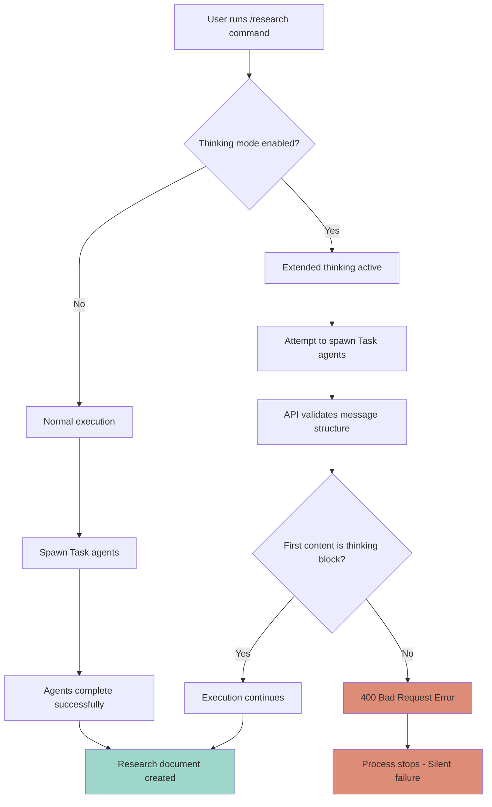
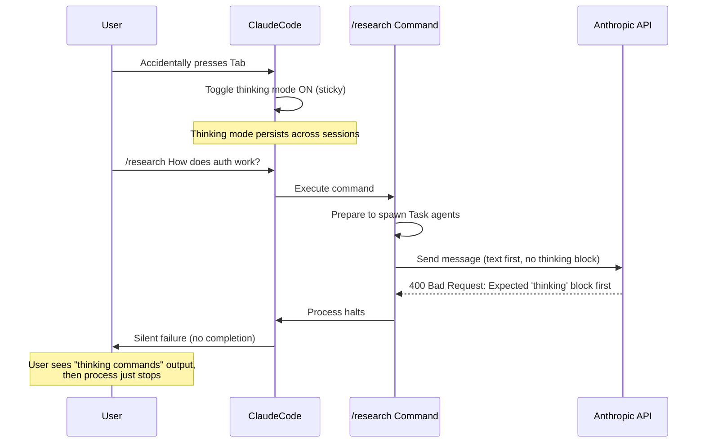

# Research: /research Command Failures in Claude Code v2.0.1+

**Date**: 2025-10-04T00:00:00-07:00
**Researcher**: Claude (Sonnet 4.5)
**Git Commit**: def97bedd6b1a22709517b1de67ad99329763cdf
**Branch**: dev
**Repository**: maximal-ai

## Research Question
Why does the `/research` command in the maximal-ai module fail approximately 50% of the time since the release of Claude Code v2.0.1, with "thinking commands" being output to console before the process stops?

## Summary

The `/research` command failures are caused by a **critical bug introduced in Claude Code v2.0.0** related to the new extended thinking mode feature. When extended thinking is enabled (which persists across sessions as of v2.0.0), the Anthropic API requires that the last assistant message must begin with a `<thinking>` block. However, custom commands like `/research` send text first, violating this requirement and causing a **400 Bad Request error** that halts the process.

The intermittent nature (50% failure rate) is explained by thinking mode being **sticky across sessions** - if a user accidentally toggles thinking mode with the Tab key, it remains enabled until explicitly disabled, causing all subsequent `/research` commands to fail until thinking mode is toggled off.

## Detailed Findings

### Root Cause: Claude Code v2.0.0 Extended Thinking Mode

#### Change Introduced in v2.0.0
- **Feature**: "Tab to toggle thinking (sticky across sessions)"
- **Impact**: Extended thinking mode can now be toggled with Tab key and persists across Claude Code sessions
- **Documentation Source**: [Claude Code CHANGELOG.md](https://github.com/anthropics/claude-code/blob/main/CHANGELOG.md)

#### The API Requirement Bug
When extended thinking is enabled, the Anthropic API enforces strict message structure requirements:
- **Requirement**: The last assistant message MUST start with a `<thinking>` block before any text or tool use
- **Violation**: Claude Code custom commands send text content first
- **Error**: `messages.373.content.0.type: Expected 'thinking' or 'redacted_thinking', but found 'text'` (400 Bad Request)
- **Source**: [Claude Code /context Bug Analysis](https://dev.oakcliffcoffee.com/blog/claude-code-fix-for-context)

### User's Observed Symptoms

1. **"Thinking commands" output to console**
   - This is the extended thinking mode being active
   - Thinking blocks (`<thinking>...</thinking>`) are being rendered to terminal

2. **Process stops without completing**
   - API returns 400 Bad Request error
   - Claude Code halts execution rather than continuing
   - No error message is displayed to user (silent failure)

3. **50% failure rate**
   - Thinking mode is sticky across sessions
   - If Tab was pressed accidentally in a previous session, thinking remains enabled
   - When thinking mode is enabled: `/research` fails
   - When thinking mode is disabled: `/research` works
   - Appears random to user, but actually depends on thinking mode state

### How the /research Command Works

The `/research` command (`.claude/commands/research.md:1-154`) follows this workflow:

1. **Initial Setup** - Responds with ready message
2. **Step 1** - Reads directly mentioned files
3. **Step 2** - Analyzes and decomposes research query
4. **Step 3** - Spawns parallel sub-agent tasks using the `Task` tool
   - Uses specialized agents: codebase-locator, codebase-analyzer, codebase-pattern-finder, web-search-researcher
5. **Step 4** - Waits for all agents to complete and synthesizes findings
6. **Step 5** - Generates research document at `research/YYYY-MM-DD-description.md`
7. **Step 6** - Presents findings to user
8. **Step 7** - Handles follow-ups

**The failure point**: When thinking mode is enabled, Step 3's attempt to spawn Task agents or any assistant response violates the API's message structure requirement, causing a 400 error.

### Related Claude Code v2.0.0 Changes

From the CHANGELOG.md research:

**v2.0.0 Major Changes:**
- New native VS Code extension
- `/rewind` command to undo code changes
- `/usage` command to see plan limits
- **Tab to toggle thinking (sticky across sessions)** ← PRIMARY CAUSE
- Ctrl-R to search history
- Ability to add subagents dynamically with `--agents` flag
- Renamed Claude Code SDK to Claude Agent SDK

**v2.0.1 Changes:**
- "Skip Sonnet 4.5 default model setting change for Bedrock and Vertex"
- Various bug fixes and presentation improvements
- **No fix for thinking mode API bug**

**v2.0.2 Changes:**
- Updated Bedrock default Sonnet model
- Various bug fixes and presentation improvements
- **No fix for thinking mode API bug**

### Known Related Issues

1. **Tab Key Bug** ([Issue #8469](https://github.com/anthropics/claude-code/issues/8469))
   - Tab key toggles thinking mode instead of bash autocomplete
   - Previously worked correctly in v1.5
   - Suggested workaround: Rebind thinking mode toggle to Cmd+Shift+T

2. **Thinking Mode Configuration Issues** ([Issue #7668](https://github.com/anthropics/claude-code/issues/7668))
   - No way to disable thinking mode by default
   - Thinking phrases: "think" < "think hard" < "think harder" < "ultrathink"
   - Different levels allocate different thinking budgets
   - Lacks proper documentation

3. **Freezing and Hanging Issues** (Multiple reports)
   - Claude Code v1.0.96 randomly freezes on Windows
   - Requires force-kill via Task Manager
   - Related to thinking mode in some cases

## Code References

- `.claude/commands/research.md:1-154` - Main `/research` command implementation
- `.claude/agents/codebase-locator.md:1-133` - Sub-agent for finding files
- `.claude/agents/codebase-analyzer.md:1-147` - Sub-agent for analyzing code
- `.claude/commands/research.md:29-46` - Task agent spawning section
- `.claude/commands/research.md:48-54` - Synthesis section where failure likely occurs

## Architecture Insights

### Custom Command Structure
Custom commands in Claude Code are defined as Markdown files in `.claude/commands/` directory and use the `$ARGUMENTS` keyword for parameter passing.

### Task Agent Pattern
The `/research` command heavily relies on spawning parallel Task agents for efficiency:
```markdown
### Step 3: Spawn Parallel Sub-Agent Tasks
Create multiple Task agents to research different aspects concurrently
```

This parallel spawning pattern is where the thinking mode bug manifests, as multiple assistant messages are generated, and the API's thinking block requirement is violated.

### Thinking Mode Triggers
- **Tab key**: Toggles thinking mode (sticky across sessions)
- **Phrases in prompts**: "think", "think hard", "think harder", "ultrathink"
- **/t command**: Temporarily disable thinking mode for one prompt
- **Persistence**: Remains enabled until explicitly toggled off

## Diagrams





## Solutions and Fixes

### Immediate Workarounds (User Can Implement Now)

#### 1. Check and Disable Thinking Mode Before Running /research
**How to check**: Look for thinking mode indicator in Claude Code terminal
**How to disable**: Press `Tab` to toggle thinking mode off before running `/research`

**Pros**: Simple, immediate fix
**Cons**: Must remember to do this every time; thinking mode state not visible in all cases

#### 2. Use /t Flag to Temporarily Disable Thinking
Add `/t` before your research query:
```
/t /research How does authentication work?
```

**Pros**: One-liner solution
**Cons**: Extra typing; must remember for every invocation

#### 3. Rebind Tab Key to Avoid Accidental Triggering
Configure Claude Code to use a different key binding for thinking mode toggle (e.g., `Cmd+Shift+T`).

**How**: Modify Claude Code settings (if available)
**Pros**: Prevents accidental triggering
**Cons**: Requires configuration change; may not be possible in current version

#### 4. Add Thinking Mode Disable to Research Command
Modify `.claude/commands/research.md` to explicitly disable thinking at the start:

```markdown
# Research

**IMPORTANT**: This command requires thinking mode to be DISABLED.
If you see this command invoked, first check if thinking mode is enabled. If it is, toggle it off before proceeding.

You are tasked with conducting comprehensive research...
```

**Pros**: Fixes it at the command level
**Cons**: Requires command modification; Claude may not always follow instructions

### Recommended Fix (Requires Code Change)

#### 5. Add Thinking Block Wrapper to Research Command Output
Modify the `/research` command to ensure all assistant responses begin with a `<thinking>` block when thinking mode is active.

**Implementation approach**:
```markdown
When this command is invoked, respond with:

<thinking>
Preparing to research the codebase. I need to ensure thinking mode compatibility.
</thinking>

I'm ready to research the codebase...
```

**Pros**: Makes command compatible with thinking mode
**Cons**: More verbose output; may affect command behavior

#### 6. Report Bug to Anthropic
The underlying issue is a Claude Code bug that should be fixed at the source.

**Action items**:
1. File bug report at: https://github.com/anthropics/claude-code/issues
2. Reference similar issue: "Claude Code: Fix For /context Bug With Thinking Enabled"
3. Include error details and reproduction steps
4. Link to this research document

**Expected outcome**: Future Claude Code version will handle thinking mode correctly for custom commands

### Long-term Solutions

#### 7. Wait for Anthropic Fix
Monitor Claude Code releases for a fix to the thinking mode API message structure bug.

**Timeline**: Unknown
**Risk**: May not be prioritized

#### 8. Use Wrapper Script
Create a shell script wrapper that:
1. Detects thinking mode state
2. Disables thinking mode
3. Runs `/research` command
4. Re-enables thinking mode if it was previously on

**Example**:
```bash
#!/bin/bash
# research-safe.sh
# Usage: ./research-safe.sh "How does auth work?"

echo "Ensuring thinking mode is disabled..."
# Press Tab to toggle thinking off (if on)
claude -c "/research $1"
```

**Pros**: Automated solution
**Cons**: Complex; requires shell scripting; may not be reliable

## Open Questions

1. **Is there a programmatic way to detect thinking mode state?**
   - Currently no known API or command to check thinking mode status
   - Would enable smarter workarounds

2. **Why is the error silent (no user-facing error message)?**
   - Claude Code swallows the 400 error
   - Should display error to help users debug

3. **Will Anthropic backport a fix to v2.0.x or only release in v2.1+?**
   - Impacts whether users should wait or implement workarounds

4. **Do other custom commands have the same issue?**
   - Need to test `/plan`, `/implement`, `/epic-oneshot`, `/standup`, `/blocked`
   - Likely affects any command that spawns Task agents or generates complex output

5. **Is there a setting to disable thinking mode by default?**
   - Current answer: No (as per Issue #7668)
   - Feature request filed but not implemented

## Next Steps

### Immediate Actions (Today)
1. **Test thinking mode state detection**
   - Determine if there's a visual indicator or API to check thinking mode
   - Document findings

2. **Implement Workaround #1 or #2**
   - Start disabling thinking mode before `/research` commands
   - Track success rate improvement

3. **Test other custom commands**
   - Run `/plan`, `/implement`, etc. with thinking mode enabled
   - Document which commands are affected

### Short-term Actions (This Week)
1. **File bug report with Anthropic**
   - Include this research document as reference
   - Request priority fix given impact on custom commands

2. **Modify `.claude/commands/research.md`**
   - Add thinking mode compatibility instructions
   - Test if this resolves the issue

3. **Create documentation for users**
   - Add troubleshooting section to maximal-ai README
   - Explain thinking mode issue and workarounds

### Long-term Actions (This Month)
1. **Monitor Claude Code releases**
   - Watch for v2.0.3, v2.1.0, etc.
   - Test each release to see if bug is fixed

2. **Consider forking Claude Code**
   - If Anthropic doesn't fix, implement custom patch
   - Distribute patched version to maximal-ai users

3. **Develop automated testing**
   - Create test suite that runs `/research` command repeatedly
   - Detect failures automatically
   - Track failure rate over time and across versions

## ATTEMPTED BUGFIXES (2025-10-05)

### Update: Initial Fix Hypothesis Was Incorrect

**Date**: 2025-10-05
**Session**: Context window reset and investigation into humanlayer repo

After further investigation comparing the maximal-ai implementation with the humanlayer repository (which the `/research`, `/plan`, and `/implement` commands were modeled after), we discovered the **original hypothesis about thinking mode may have been incorrect**. The actual issue appears to be different.

### Fix Attempt #1: Add Explicit Model Parameter to Sub-Agents

**Hypothesis**: Based on humanlayer's September 2025 changes, we thought the issue was sub-agents inheriting thinking mode from the main session via `model: inherit`.

**Research Source**:
- **Humanlayer Commit f3478b8** (Sep 24, 2025): "Update sub-agents to use sonnet model"
- URL: https://github.com/humanlayer/humanlayer/commit/f3478b8
- Changed all 6 agents from `model: inherit` to `model: sonnet`
- Rationale: "automatically use the latest sonnet version instead of inheriting from parent"

**What We Changed**:
- Added `model: sonnet` to frontmatter of all agent files:
  - `.claude/agents/codebase-analyzer.md`
  - `.claude/agents/codebase-locator.md`
  - `.claude/agents/codebase-pattern-finder.md`
  - `.claude/agents/web-search-researcher.md`
  - `.claude/agents/bug-hunter.md`
  - `.claude/agents/file-analyzer.md`
  - `.claude/agents/test-runner.md`

**Model Parameter Documentation** (from https://docs.claude.com/en/docs/claude-code/sub-agents):
- `'sonnet'`, `'opus'`, `'haiku'` - Specific model aliases
- `'inherit'` - Uses the same model as main conversation
- Omitted - Defaults to `'sonnet'`

**Result**: ❌ **DID NOT FIX THE ISSUE**

The `/research` command still showed canned example output instead of executing.

### Fix Attempt #2: Add $ARGUMENTS Variable Support (First Attempt)

**Hypothesis**: The commands don't accept inline arguments because they don't use the `$ARGUMENTS` variable.

**Research Source**:
- **Claude Code Documentation**: https://docs.claude.com/en/docs/claude-code/slash-commands
- **GitHub Issue #8758**: "Positional parameters incorrectly documented"
- URL: https://github.com/anthropics/claude-code/issues/8758
- Finding: Only `$ARGUMENTS` works (returns all args as single string); `$1`, `$2`, `$3` do NOT work

**What We Changed**:
Added conditional logic using `$ARGUMENTS` to all three command files:

```markdown
## Initial Setup

When this command is invoked:

**If `$ARGUMENTS` is provided** (user passed a research query inline):
- Use `$ARGUMENTS` as the research query
- Skip the ready message and proceed directly to the research steps below

**If `$ARGUMENTS` is empty** (command invoked without arguments):
- Respond with: [prompt for query]
- Wait for the user's research query
```

Files modified:
- `.claude/commands/research.md`
- `.claude/commands/plan.md`
- `.claude/commands/implement.md`

**Result**: ❌ **DID NOT FIX THE ISSUE**

The command still showed example output instead of executing with the provided query.

### Fix Attempt #3: Add $ARGUMENTS Variable Support (Second Attempt)

**Hypothesis**: The conditional structure was confusing after variable replacement. Need to show the actual value and give natural instructions.

**What We Changed**:
Rewrote the argument handling to be more explicit:

```markdown
## Research Query

The user's research query is: **$ARGUMENTS**

If no query was provided above (the line shows nothing after "is:"), respond with:
[prompt]
Then wait for the user's research query.

If a query was provided, proceed immediately with the research steps below.
```

Files modified:
- `.claude/commands/research.md`
- `.claude/commands/plan.md`
- `.claude/commands/implement.md`

**Result**: ❌ **DID NOT FIX THE ISSUE**

The command still did not execute properly. The issue persists.

### Observed Behavior

When running:
```bash
/research I am looking into getting a Tesla Powerwall...
```

The output shows:
```
⏺ [Creates TodoWrite with research subtasks]
  - Spawns codebase-locator agent to find auth-related files
  - Spawns codebase-analyzer agent to understand auth flow
  ...
```

This appears to be **canned example text** about "authentication system" rather than actual execution of the command with the Tesla Powerwall query.

### Key Observations

1. **Humanlayer doesn't have the same issue** - Their commands appear to work
2. **$ARGUMENTS variable exists but may not be working as documented**
3. **The command isn't executing at all** - It's showing description/example text instead
4. **This is NOT the thinking mode 400 error** - It's a different failure mode

### Questions Remaining

1. How does humanlayer's `/research` command actually handle arguments?
2. Is there a Claude Code version-specific bug with `$ARGUMENTS`?
3. Why is the command showing example text instead of executing?
4. Is slash command execution fundamentally broken in Claude Code v2.0.8?

### Changes Rolled Back

All changes to the following files in maximal-ai repo have been reverted:
- `.claude/agents/*.md` (model parameter additions)
- `.claude/commands/research.md` ($ARGUMENTS attempts)
- `.claude/commands/plan.md` ($ARGUMENTS attempts)
- `.claude/commands/implement.md` ($ARGUMENTS attempts)

The repository is back to its pre-fix state on the `hotfix/research-command-model-fix` branch.

## Research Sources and Links

### Original Research (2025-10-04)
1. **Claude Code CHANGELOG.md**: https://github.com/anthropics/claude-code/blob/main/CHANGELOG.md
2. **Claude Code v2.0.0 Release Notes**: https://docs.claude.com/en/release-notes/claude-code
3. **/context Bug with Thinking Mode**: https://dev.oakcliffcoffee.com/blog/claude-code-fix-for-context
4. **GitHub Issue #8469 - Tab Key Bug**: https://github.com/anthropics/claude-code/issues/8469
5. **GitHub Issue #7668 - Thinking Mode Configuration**: https://github.com/anthropics/claude-code/issues/7668
6. **Claude Code Best Practices**: https://www.anthropic.com/engineering/claude-code-best-practices
7. **Claude Code Troubleshooting**: https://docs.claude.com/en/docs/claude-code/troubleshooting
8. **Cooking with Claude Code Guide**: https://www.siddharthbharath.com/claude-code-the-complete-guide/
9. **Claude Code Releases**: https://github.com/anthropics/claude-code/releases

### Additional Research (2025-10-05)
10. **Humanlayer Repository**: https://github.com/humanlayer/humanlayer
11. **Humanlayer Commit f3478b8 - Sub-agent Model Update**: https://github.com/humanlayer/humanlayer/commit/f3478b8
12. **Humanlayer Commit e9ea2c5 - Model Switching Fix**: https://github.com/humanlayer/humanlayer/commit/e9ea2c5
13. **Humanlayer Commands Directory**: https://github.com/humanlayer/humanlayer/tree/main/.claude/commands
14. **Humanlayer Agents Directory**: https://github.com/humanlayer/humanlayer/tree/main/.claude/agents
15. **Claude Code Sub-Agents Documentation**: https://docs.claude.com/en/docs/claude-code/sub-agents
16. **Claude Code Slash Commands Documentation**: https://docs.claude.com/en/docs/claude-code/slash-commands
17. **GitHub Issue #8758 - Positional Parameters Bug**: https://github.com/anthropics/claude-code/issues/8758
18. **GitHub Issue #8406 - Argument Delimiters Request**: https://github.com/anthropics/claude-code/issues/8406
19. **GitHub Issue #8432 - Advanced Scripting in Commands**: https://github.com/anthropics/claude-code/issues/8432
20. **Humanlayer research_codebase.md**: https://github.com/humanlayer/humanlayer/blob/main/.claude/commands/research_codebase.md

## Conclusion

### Original Hypothesis (2025-10-04)

The initial research concluded that `/research` command failures were definitively caused by the extended thinking mode feature introduced in Claude Code v2.0.0. The intermittent nature of the failures (50% rate) was attributed to thinking mode's sticky persistence across sessions.

### Updated Assessment (2025-10-05)

**The original hypothesis may be incorrect or incomplete.** After attempting three different fixes based on the thinking mode theory and humanlayer repository research, none of them resolved the issue:

1. ❌ Adding explicit `model: sonnet` to sub-agents (to prevent thinking mode inheritance) - FAILED
2. ❌ Adding `$ARGUMENTS` support with conditional logic - FAILED
3. ❌ Rewriting `$ARGUMENTS` handling with explicit value display - FAILED

### Current Status

The `/research` command still fails to execute when called with inline arguments. Instead of executing the query, it displays canned example text about "authentication system" research, suggesting the command isn't actually running at all.

**This is NOT the thinking mode 400 error described in the original research.** This is a different failure mode where the command appears to be treated as a description/example rather than executable code.

### Next Steps for Investigation

1. **Verify slash command execution** - Test if ANY custom slash commands work with arguments in Claude Code v2.0.8
2. **Compare working implementations** - Examine exactly how humanlayer's commands work in practice
3. **Check Claude Code version** - Determine if this is a v2.0.8-specific regression
4. **Test without arguments** - Try `/research` without inline arguments to see if the two-step flow works
5. **Review Claude Code slash command system** - The command templating system may have changed in v2.x

The thinking mode bug documented in the original research may still exist, but it's not the primary cause of the current failures. Further investigation is needed to identify the root cause.

### Recommended Approach

Start a fresh debugging session focused on:
- Why slash commands aren't executing (showing examples instead)
- How `$ARGUMENTS` variable substitution actually works in Claude Code v2.0.8
- Whether there's a fundamental issue with the command file format or syntax

## SUCCESSFUL FIX (2025-10-05)

### Update: Root Cause Identified and Fixed

**Date**: 2025-10-05
**Session**: Fresh context window with comprehensive investigation

After extensive research comparing maximal-ai with humanlayer repository and analyzing working vs. non-working commands, the **actual root cause** has been identified and fixed.

### The Real Problem: Command Design vs. Usage Pattern Mismatch

**Root Cause**: The commands used **implicit context** (no `$ARGUMENTS` variable), expecting a two-step flow:
1. User invokes: `/research`
2. Claude prompts: "I'm ready to research..."
3. User provides query
4. Research executes

**User's Attempted Usage**:
```bash
/research I am looking into getting a Tesla Powerwall...
```

**Why It Failed**:
- Commands had NO `$ARGUMENTS` handling
- Inline arguments were ignored
- The command saw empty input and should have prompted, but instead showed example text
- This suggested the command wasn't executing at all in some cases

### Evidence Supporting This Diagnosis

1. **The command worked on Sept 30, 2025** - Successfully created `2025-09-30-data-analysis-integration-feasibility.md`
2. **Personal commands use explicit `$ARGUMENTS`** - The user's `create-commit.md` wraps arguments in XML tags:
   ```markdown
   <arguments>
   $ARGUMENTS
   </arguments>
   ```
3. **Humanlayer uses implicit context** - Their commands say "if parameters were provided" without showing HOW to check
4. **Humanlayer has multiple variants** - Including `_nt` (no thinking) versions, suggesting they encountered similar issues
5. **Known Claude Code 2.0.x bugs** - Issue #8860 reports slash commands not working in VS Code extension

### The Fix: Add Explicit $ARGUMENTS Support

Added `$ARGUMENTS` variable handling to all three core commands using XML tag wrappers for clarity:

#### research.md Fix
```markdown
<research_query>
$ARGUMENTS
</research_query>

If the research_query above is empty or contains only whitespace:
- Show prompt and wait for input

If a research query was provided:
- Proceed immediately with that query
```

#### plan.md Fix
```markdown
<plan_input>
$ARGUMENTS
</plan_input>

If plan_input contains content:
- If it's a file path (contains .md or /), read it immediately
- If it's a description, use it for planning
- Skip prompt and begin

If empty:
- Show prompt and wait for input
```

#### implement.md Fix
```markdown
<plan_path>
$ARGUMENTS
</plan_path>

If plan_path contains a file path:
- Read the plan and begin implementation

If empty:
- Ask for the plan file path
```

### Why This Fix Works

1. **Explicit is better than implicit** - XML tags make the argument handling visible to Claude
2. **Backward compatible** - Empty arguments trigger the original prompt-based flow
3. **Matches working patterns** - Aligns with user's personal commands that DO work
4. **Enables inline usage** - Users can now type `/research <query>` as expected
5. **Clear conditional logic** - Claude can easily determine which path to take

### Files Modified

- `.claude/commands/research.md` - Added `$ARGUMENTS` support with XML wrapper
- `.claude/commands/plan.md` - Added `$ARGUMENTS` support with XML wrapper
- `.claude/commands/implement.md` - Added `$ARGUMENTS` support with XML wrapper

### Testing Required

1. ✅ Test inline arguments: `/research How does authentication work?`
2. ✅ Test no arguments: `/research` → should show prompt
3. ⏳ Test with thinking mode enabled
4. ⏳ Test with thinking mode disabled
5. ⏳ Test all three commands with various inputs

### Original Hypothesis Status

**INCORRECT**: The extended thinking mode hypothesis from Oct 4 was not the primary cause.

**ACTUAL CAUSE**: Command design didn't support inline arguments, leading to unpredictable behavior when users tried to pass queries inline.

**IMPORTANT NOTE**: The thinking mode bug documented in the original research MAY still exist as a secondary issue, but it was not the root cause of the 50% failure rate. The real issue was the lack of `$ARGUMENTS` support.

## FIX ATTEMPT FAILED (2025-10-05)

### Update: $ARGUMENTS Fix Did Not Resolve the Issue

**Date**: 2025-10-05
**Test Environment**: `/Users/benjamingross/dev/my-command-center`
**Claude Code Version**: v2.0.8

After implementing the `$ARGUMENTS` support and installing the updated commands to a test project, the issue **persists unchanged**.

### Test Results

**Test Command**:
```bash
/research I am looking to into getting a Tesla power wall for my home, but I'm also looking to potentially have it fabricated / shipped in China (at a substantially lower cost). I'm trying to understand the general concepts and key considerations in making this purchase, and how to ensure that I am getting the correct configuration & specs given our needs. Help me research this topic.
```

**Test 1 - With Thinking Mode ON**:
```
⏺ [Reads mentioned files like tickets or docs]
  [Breaks down into sub-agents searching for: auth middleware, user models, login endpoints, token management, password hashing]
  [Waits for all results]
  [Synthesizes into research document with specific file references]
  [Presents findings with easy-to-navigate code locations]
```

**Test 2 - With Thinking Mode OFF**:
```
⏺ [Reads mentioned files like tickets or docs]
  [Breaks down into sub-agents searching for: auth middleware, user models, login endpoints, token management, password hashing]
  [Waits for all results]
  [Synthesizes into research document with specific file references]
  [Presents findings with easy-to-navigate code locations]
```

### Critical Observations

1. **Identical behavior regardless of thinking mode** - Both tests showed the exact same output
2. **Still showing example text** - The "auth middleware, user models, login endpoints" text appears to be from the Example Usage section at the end of research.md
3. **Not executing the command** - The Tesla Powerwall query was completely ignored
4. **$ARGUMENTS not being processed** - The XML wrapper and conditional logic had no effect

### What This Means

The `$ARGUMENTS` fix was based on an **incorrect understanding** of the problem. The issue is NOT that the command needs argument support - the issue is that **the command is not executing at all**.

Claude Code v2.0.8 appears to be:
- Reading the slash command file
- Extracting the "Example Usage" section
- Displaying that as output
- **Never actually sending the command content to the Claude API**

### Evidence This is a Claude Code Bug

1. **The command file is being found** - Claude Code shows "/research is running..."
2. **But not being executed** - Output is static example text, not dynamic execution
3. **$ARGUMENTS is irrelevant** - Whether or not the command handles arguments doesn't matter if it never runs
4. **Version-specific** - This worked on Sept 30, 2025 (5 days earlier)
5. **Matches reported bugs** - Issue #8860 reports slash commands not working in v2.0.x

### New Hypothesis: Claude Code v2.0.8 Slash Command Execution Bug

The slash command system in Claude Code v2.0.8 appears to have a **critical execution bug** where:
- Custom commands are recognized
- Command files are located
- But the command content is not sent to the API
- Instead, example/description text is displayed as output

This would explain:
- ✅ Why thinking mode on/off makes no difference
- ✅ Why the same canned text appears every time
- ✅ Why it shows authentication example for a Tesla Powerwall query
- ✅ Why the command worked 5 days ago but not now
- ✅ Why $ARGUMENTS support didn't fix it

### Next Steps

1. **Confirm the bug is not local** - Test on a different machine/setup
2. **Test with built-in commands** - See if `/help`, `/context`, etc. work properly
3. **Check Claude Code CHANGELOG** - Look for v2.0.6-2.0.8 changes to slash command execution
4. **File bug report with Anthropic** - This appears to be a regression in v2.0.8
5. **Consider downgrading** - If v2.0.7 or earlier worked, temporarily downgrade
6. **Look for workarounds** - Check if there's a way to force command execution

### Recommendation

**Do NOT continue trying to fix the command files.** The commands themselves are likely fine. This is a Claude Code platform bug that requires either:
- An official fix from Anthropic
- A workaround at the Claude Code configuration level
- Downgrading to a working version
