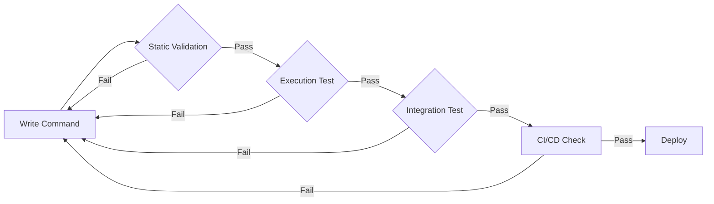
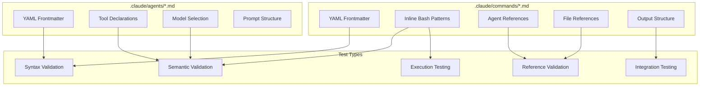
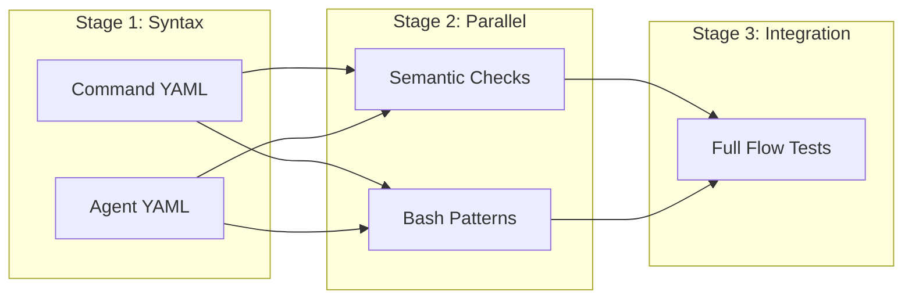

# Command & Agent Testing Standards

This document defines comprehensive testing requirements for Claude Code slash commands and agents in the maximal-ai toolkit.

## Overview

Commands (`.claude/commands/*.md`) and agents (`.claude/agents/*.md`) are the core building blocks of the maximal-ai workflow. Both require thorough testing to ensure they work reliably across different environments.

**What can break:**
- Invalid YAML frontmatter
- Missing required fields
- References to non-existent agents/files
- Invalid tool declarations
- Unsafe inline bash patterns
- Broken markdown structure
- Incorrect output formats



## Test Categories



---

## Testing Commands

### Command Structure

Commands live in `.claude/commands/*.md` and have this structure:

```markdown
---
description: Short description shown in command list
allowed-tools: Bash(git:*), Read, Write  # Optional
---

# Command Name

## Pre-computed Context
!`git status`  <!-- Inline bash -->
!`ls -la`

## Instructions
Use the **codebase-locator** agent to find...  <!-- Agent reference -->

## Output
Create file at `thoughts/plans/...`  <!-- File reference -->
```

### What to Test in Commands

| Test Type | What to Check | Example Failure |
|-----------|---------------|-----------------|
| **Frontmatter** | Valid YAML, `description` present | Missing colon, no description |
| **Inline Bash** | No unsafe patterns, executes without error | `$()` causing parse error |
| **Agent References** | Referenced agents exist | `Use the **foo-agent**` but no `foo-agent.md` |
| **File References** | Referenced paths are valid patterns | `thoughts/plnas/` (typo) |
| **Output Artifacts** | Expected outputs are documented | No clear output section |

### Command Validation Script

```python
# tests/commands/test_commands.py
"""Comprehensive command validation tests."""

import re
import subprocess
from pathlib import Path
from typing import Any

import pytest
import yaml


def parse_frontmatter(content: str) -> tuple[dict[str, Any], str]:
    """Extract YAML frontmatter and body from markdown."""
    if not content.startswith('---'):
        return {}, content

    parts = content.split('---', 2)
    if len(parts) < 3:
        return {}, content

    try:
        frontmatter = yaml.safe_load(parts[1])
        body = parts[2]
        return frontmatter or {}, body
    except yaml.YAMLError as e:
        pytest.fail(f"Invalid YAML frontmatter: {e}")


def extract_agent_references(content: str) -> list[str]:
    """Find all **agent-name** patterns that look like agent refs."""
    # Pattern: **word-word** agent or **word-word** sub-agent
    matches = re.findall(r'\*\*([a-z]+-[a-z-]+)\*\*(?:\s+(?:agent|sub-agent))?', content)
    return list(set(matches))


def extract_file_references(content: str) -> list[str]:
    """Find file path patterns in content."""
    # Common patterns: thoughts/plans/, .claude/commands/, etc.
    patterns = re.findall(r'(?:thoughts|\.claude)/[a-z-]+/', content)
    return list(set(patterns))


class TestCommandSyntax:
    """Test command file syntax."""

    @pytest.fixture
    def command_files(self) -> list[Path]:
        return list(Path('.claude/commands').glob('*.md'))

    def test_frontmatter_is_valid_yaml(self, command_files: list[Path]) -> None:
        """All commands must have valid YAML frontmatter."""
        for cmd in command_files:
            content = cmd.read_text()
            frontmatter, _ = parse_frontmatter(content)
            assert isinstance(frontmatter, dict), f"{cmd.name}: Invalid frontmatter"

    def test_description_present(self, command_files: list[Path]) -> None:
        """All commands must have a description."""
        for cmd in command_files:
            content = cmd.read_text()
            frontmatter, _ = parse_frontmatter(content)
            assert 'description' in frontmatter, f"{cmd.name}: Missing description"
            assert len(frontmatter['description']) > 10, f"{cmd.name}: Description too short"


class TestCommandReferences:
    """Test that command references are valid."""

    @pytest.fixture
    def agent_names(self) -> set[str]:
        """Get all available agent names."""
        agents = Path('.claude/agents').glob('*.md')
        return {a.stem for a in agents}

    @pytest.fixture
    def command_files(self) -> list[Path]:
        return list(Path('.claude/commands').glob('*.md'))

    def test_agent_references_exist(
        self, command_files: list[Path], agent_names: set[str]
    ) -> None:
        """All referenced agents must exist."""
        for cmd in command_files:
            content = cmd.read_text()
            refs = extract_agent_references(content)

            for ref in refs:
                # Skip known non-agent patterns
                if ref in ('dry-run', 'in-progress', 'pre-commit'):
                    continue
                assert ref in agent_names, \
                    f"{cmd.name}: References non-existent agent '{ref}'"

    def test_file_paths_are_valid(self, command_files: list[Path]) -> None:
        """Referenced directories should exist or be creatable."""
        valid_dirs = {
            'thoughts/plans/',
            'thoughts/research/',
            'thoughts/handoffs/',
            'thoughts/reviews/',
            '.claude/commands/',
            '.claude/agents/',
        }

        for cmd in command_files:
            content = cmd.read_text()
            refs = extract_file_references(content)

            for ref in refs:
                assert ref in valid_dirs, \
                    f"{cmd.name}: References unknown directory '{ref}'"
```

---

## Testing Agents

### Agent Structure

Agents live in `.claude/agents/*.md` and have this structure:

```markdown
---
name: agent-name
description: What this agent does
tools: Glob, Grep, Read, Bash
model: sonnet
---

# Agent Instructions

You are a specialist at...

## Responsibilities
...

## Output Format
...
```

### What to Test in Agents

| Test Type | What to Check | Example Failure |
|-----------|---------------|-----------------|
| **Frontmatter** | Valid YAML, required fields present | Missing `name` or `tools` |
| **Name Match** | `name` field matches filename | `name: foo` but file is `bar.md` |
| **Valid Tools** | Tools are real Claude Code tools | `tools: FakeAnalyzer` |
| **Valid Model** | Model is sonnet/opus/haiku | `model: gpt-4` |
| **Output Format** | Clear output structure documented | No output section |

### Agent Validation Script

```python
# tests/agents/test_agents.py
"""Comprehensive agent validation tests."""

from pathlib import Path
from typing import Any

import pytest
import yaml


VALID_TOOLS = {
    'Bash', 'Read', 'Write', 'Edit', 'Glob', 'Grep',
    'WebFetch', 'WebSearch', 'Task', 'TodoWrite',
    'NotebookEdit', 'AskUserQuestion',
}

VALID_MODELS = {'sonnet', 'opus', 'haiku'}


def parse_frontmatter(content: str) -> tuple[dict[str, Any], str]:
    """Extract YAML frontmatter and body from markdown."""
    if not content.startswith('---'):
        return {}, content

    parts = content.split('---', 2)
    if len(parts) < 3:
        return {}, content

    try:
        frontmatter = yaml.safe_load(parts[1])
        return frontmatter or {}, parts[2]
    except yaml.YAMLError as e:
        pytest.fail(f"Invalid YAML frontmatter: {e}")


class TestAgentSyntax:
    """Test agent file syntax."""

    @pytest.fixture
    def agent_files(self) -> list[Path]:
        return list(Path('.claude/agents').glob('*.md'))

    def test_frontmatter_is_valid_yaml(self, agent_files: list[Path]) -> None:
        """All agents must have valid YAML frontmatter."""
        for agent in agent_files:
            content = agent.read_text()
            frontmatter, _ = parse_frontmatter(content)
            assert isinstance(frontmatter, dict), f"{agent.name}: Invalid frontmatter"

    def test_required_fields_present(self, agent_files: list[Path]) -> None:
        """All agents must have name, description, tools."""
        required = {'name', 'description', 'tools'}

        for agent in agent_files:
            content = agent.read_text()
            frontmatter, _ = parse_frontmatter(content)

            missing = required - set(frontmatter.keys())
            assert not missing, f"{agent.name}: Missing fields: {missing}"

    def test_name_matches_filename(self, agent_files: list[Path]) -> None:
        """Agent name field must match filename."""
        for agent in agent_files:
            content = agent.read_text()
            frontmatter, _ = parse_frontmatter(content)

            expected_name = agent.stem
            actual_name = frontmatter.get('name', '')
            assert actual_name == expected_name, \
                f"{agent.name}: name '{actual_name}' doesn't match filename"


class TestAgentSemantics:
    """Test agent semantic validity."""

    @pytest.fixture
    def agent_files(self) -> list[Path]:
        return list(Path('.claude/agents').glob('*.md'))

    def test_tools_are_valid(self, agent_files: list[Path]) -> None:
        """All declared tools must be valid Claude Code tools."""
        for agent in agent_files:
            content = agent.read_text()
            frontmatter, _ = parse_frontmatter(content)

            tools_str = frontmatter.get('tools', '')
            tools = [t.strip() for t in tools_str.split(',')]

            for tool in tools:
                assert tool in VALID_TOOLS, \
                    f"{agent.name}: Invalid tool '{tool}'. Valid: {VALID_TOOLS}"

    def test_model_is_valid(self, agent_files: list[Path]) -> None:
        """Model must be sonnet, opus, or haiku."""
        for agent in agent_files:
            content = agent.read_text()
            frontmatter, _ = parse_frontmatter(content)

            model = frontmatter.get('model', 'sonnet')  # Default is sonnet
            assert model in VALID_MODELS, \
                f"{agent.name}: Invalid model '{model}'. Valid: {VALID_MODELS}"

    def test_has_output_format_section(self, agent_files: list[Path]) -> None:
        """Agents should document their output format."""
        for agent in agent_files:
            content = agent.read_text()
            _, body = parse_frontmatter(content)

            has_output = any(marker in body.lower() for marker in [
                '## output', '### output', 'output format', 'response format'
            ])
            assert has_output, f"{agent.name}: Missing output format documentation"
```

---

## Testing Layers (Inline Bash)

### Layer 1: Static Validation

**Purpose**: Catch unsafe patterns before execution.

**What to Check**:

| Pattern | Status | Reason |
|---------|--------|--------|
| `!`git status`` | Safe | Simple command |
| `!`git log --oneline -10`` | Safe | Flags are fine |
| `!`ls -t *.md \| head -5`` | Safe | Simple pipes OK |
| `!`echo $ARGUMENTS`` | Safe | Variable expansion OK |
| `!`PR=$(echo "x")`` | UNSAFE | Command substitution `$()` |
| `!`echo $((1+1))`` | UNSAFE | Arithmetic `$(())` |
| `!`[[ -f x ]] && cat x`` | UNSAFE | Bash conditionals `[[]]` |
| `!`for f in *; do echo $f; done`` | UNSAFE | Loops unreliable |

**Validation Script**:

```bash
#!/bin/bash
# tests/commands/validate_bash_patterns.sh

set -e

UNSAFE_PATTERNS=(
    '\$\('           # Command substitution
    '\$\(\('         # Arithmetic
    '\[\['           # Bash test brackets
    'for .* in .* do' # For loops
    'while .* do'    # While loops
    'if \[.*\]; then' # If statements
)

EXIT_CODE=0

for cmd in .claude/commands/*.md; do
    for pattern in "${UNSAFE_PATTERNS[@]}"; do
        # Only check inside !` backtick blocks
        if grep -E "!\`[^\`]*${pattern}" "$cmd" >/dev/null 2>&1; then
            echo "UNSAFE: $cmd contains '$pattern' in inline bash"
            EXIT_CODE=1
        fi
    done
done

if [ $EXIT_CODE -eq 0 ]; then
    echo "All command files pass static validation"
fi

exit $EXIT_CODE
```

### Layer 2: Execution Testing

**Purpose**: Verify bash patterns execute without errors.

**Test File**:

```python
# tests/commands/test_inline_bash.py
"""Test inline bash patterns in slash commands."""

import re
import subprocess
from pathlib import Path

import pytest


def extract_inline_bash(content: str) -> list[tuple[str, int]]:
    """Extract all !`...` patterns with line numbers."""
    patterns = []
    for i, line in enumerate(content.split('\n'), 1):
        matches = re.findall(r'!\`([^`]+)\`', line)
        for match in matches:
            patterns.append((match, i))
    return patterns


def substitute_variables(pattern: str) -> str:
    """Replace command variables with test values."""
    substitutions = {
        '$ARGUMENTS': '123',
        '$1': '123',
        '$2': 'test',
        '$3': 'value',
    }
    for var, val in substitutions.items():
        pattern = pattern.replace(var, val)
    return pattern


class TestInlineBashPatterns:
    """Test all inline bash patterns in command files."""

    @pytest.fixture
    def command_files(self) -> list[Path]:
        """Get all command files."""
        return list(Path('.claude/commands').glob('*.md'))

    def test_all_patterns_execute(self, command_files: list[Path]) -> None:
        """Verify all inline bash patterns execute without parse errors."""
        failures = []

        for cmd_file in command_files:
            content = cmd_file.read_text()
            patterns = extract_inline_bash(content)

            for pattern, line_num in patterns:
                test_pattern = substitute_variables(pattern)

                try:
                    result = subprocess.run(
                        ['bash', '-n', '-c', test_pattern],  # -n = syntax check only
                        capture_output=True,
                        text=True,
                        timeout=5
                    )

                    if result.returncode != 0:
                        failures.append({
                            'file': cmd_file.name,
                            'line': line_num,
                            'pattern': pattern[:50] + '...' if len(pattern) > 50 else pattern,
                            'error': result.stderr.strip()
                        })
                except subprocess.TimeoutExpired:
                    failures.append({
                        'file': cmd_file.name,
                        'line': line_num,
                        'pattern': pattern[:50],
                        'error': 'Timeout'
                    })

        if failures:
            msg = "Inline bash pattern failures:\n"
            for f in failures:
                msg += f"  {f['file']}:{f['line']} - {f['error']}\n"
                msg += f"    Pattern: {f['pattern']}\n"
            pytest.fail(msg)

    def test_patterns_produce_output(self, command_files: list[Path], tmp_path: Path) -> None:
        """Verify patterns that should produce output actually do."""
        # Create test environment
        (tmp_path / 'thoughts/reviews').mkdir(parents=True)
        (tmp_path / 'thoughts/plans').mkdir(parents=True)

        for cmd_file in command_files:
            content = cmd_file.read_text()
            patterns = extract_inline_bash(content)

            for pattern, _ in patterns:
                # Skip patterns that legitimately produce no output
                if 'echo "No ' in pattern or '|| echo' in pattern:
                    continue

                test_pattern = substitute_variables(pattern)

                result = subprocess.run(
                    ['bash', '-c', f'cd {tmp_path} && {test_pattern}'],
                    capture_output=True,
                    text=True,
                    timeout=5
                )

                # Pattern should either succeed or fail gracefully
                assert result.returncode in (0, 1), \
                    f"Unexpected exit code {result.returncode} for {pattern}"
```

### Layer 3: Integration Testing

**Purpose**: Test full command execution in realistic environment.

**Test Structure**:

```bash
# tests/commands/test_command_integration.sh

#!/bin/bash
set -e

TEST_DIR=$(mktemp -d)
trap "rm -rf $TEST_DIR" EXIT

cd "$TEST_DIR"

# Set up test environment
git init
git config user.email "test@example.com"
git config user.name "Test"

# Create required directories
mkdir -p .claude/commands thoughts/{plans,reviews,research}

# Copy commands
cp -r "$OLDPWD/.claude/commands/"* .claude/commands/

# Test each command's pre-computed context
for cmd in .claude/commands/*.md; do
    echo "Testing: $cmd"

    # Extract and test inline bash
    grep -oE '!\`[^`]+\`' "$cmd" | while read -r line; do
        pattern="${line:2:-1}"  # Remove !` and `
        pattern="${pattern//\$ARGUMENTS/123}"
        pattern="${pattern//\$1/123}"

        if ! bash -c "$pattern" 2>/dev/null; then
            echo "  WARN: Pattern may fail: ${pattern:0:40}..."
        fi
    done
done

echo "Integration tests complete"
```

### Layer 4: CI/CD Pipeline

**GitHub Actions Workflow**:

```yaml
# .github/workflows/test-commands-agents.yml
name: Test Commands & Agents

on:
  push:
    paths:
      - '.claude/commands/**'
      - '.claude/agents/**'
      - 'tests/commands/**'
      - 'tests/agents/**'
  pull_request:
    paths:
      - '.claude/commands/**'
      - '.claude/agents/**'

jobs:
  validate-syntax:
    name: Syntax Validation
    runs-on: ubuntu-latest
    steps:
      - uses: actions/checkout@v4

      - name: Set up Python
        uses: actions/setup-python@v5
        with:
          python-version: '3.12'

      - name: Install dependencies
        run: pip install pytest pyyaml

      - name: Validate command syntax
        run: pytest tests/commands/test_commands.py::TestCommandSyntax -v

      - name: Validate agent syntax
        run: pytest tests/agents/test_agents.py::TestAgentSyntax -v

  validate-semantics:
    name: Semantic Validation
    runs-on: ubuntu-latest
    needs: validate-syntax
    steps:
      - uses: actions/checkout@v4

      - name: Set up Python
        uses: actions/setup-python@v5
        with:
          python-version: '3.12'

      - name: Install dependencies
        run: pip install pytest pyyaml

      - name: Validate agent semantics (tools, model)
        run: pytest tests/agents/test_agents.py::TestAgentSemantics -v

      - name: Validate command references
        run: pytest tests/commands/test_commands.py::TestCommandReferences -v

  validate-bash-patterns:
    name: Bash Pattern Validation
    runs-on: ubuntu-latest
    needs: validate-syntax
    steps:
      - uses: actions/checkout@v4

      - name: Validate bash patterns (static)
        run: |
          chmod +x tests/commands/validate_bash_patterns.sh
          ./tests/commands/validate_bash_patterns.sh

      - name: Set up Python
        uses: actions/setup-python@v5
        with:
          python-version: '3.12'

      - name: Install dependencies
        run: pip install pytest

      - name: Test bash pattern execution
        run: pytest tests/commands/test_inline_bash.py -v

  integration-tests:
    name: Integration Tests
    runs-on: ubuntu-latest
    needs: [validate-semantics, validate-bash-patterns]
    steps:
      - uses: actions/checkout@v4

      - name: Install gh CLI
        run: |
          type -p curl >/dev/null || sudo apt install curl -y
          curl -fsSL https://cli.github.com/packages/githubcli-archive-keyring.gpg | sudo dd of=/usr/share/keyrings/githubcli-archive-keyring.gpg
          echo "deb [arch=$(dpkg --print-architecture) signed-by=/usr/share/keyrings/githubcli-archive-keyring.gpg] https://cli.github.com/packages stable main" | sudo tee /etc/apt/sources.list.d/github-cli.list > /dev/null
          sudo apt update
          sudo apt install gh -y

      - name: Run integration tests
        run: |
          chmod +x tests/commands/test_command_integration.sh
          ./tests/commands/test_command_integration.sh
```

### CI/CD Test Flow



## Safe Inline Bash Patterns

### Pattern Reference

```markdown
# Git commands (all safe)
!`git status --short`
!`git branch --show-current`
!`git log --oneline -10`
!`git diff HEAD`
!`git diff --stat`
!`git rev-parse --short HEAD`

# File listing (safe with simple globs)
!`ls -t thoughts/plans/*.md | head -5`
!`ls thoughts/reviews/*.md 2>/dev/null | wc -l`

# Variable usage (safe)
!`echo "$ARGUMENTS"`
!`gh pr view $1 --json title`

# Pipes (safe if simple)
!`git diff --name-only | head -20`
!`grep -E 'pattern' file.md | wc -l`

# Fallbacks (safe)
!`command 2>/dev/null || echo "fallback"`
```

### Patterns to Avoid

```markdown
# Command substitution - AVOID
!`VAR=$(command)`
!`echo $(date)`

# Arithmetic - AVOID
!`echo $((1 + 1))`

# Conditionals - AVOID
!`[[ -f file ]] && cat file`
!`if [ -f file ]; then cat file; fi`

# Loops - AVOID
!`for f in *.md; do echo $f; done`

# Complex pipelines - AVOID
!`cmd1 | cmd2 | cmd3 | cmd4`
```

### Refactoring Unsafe Patterns

**Before** (unsafe):
```markdown
!`PR_NUM=$(echo "$ARGUMENTS" | grep -oE '[0-9]+'); ls thoughts/reviews/*-pr-${PR_NUM}-*.md`
```

**After** (safe - split into multiple lines):
```markdown
### PR Number
!`echo "$ARGUMENTS" | grep -oE '[0-9]+' | head -1`

### Existing Reviews
!`ls -t thoughts/reviews/*-review-*.md 2>/dev/null | head -10 || echo "None"`

### Review Count
!`ls thoughts/reviews/*-review-*.md 2>/dev/null | wc -l || echo "0"`
```

Then instruct Claude to use these values (Claude can do the math/filtering).

## Adding Tests for New Commands

When creating a new slash command:

1. **Run static validation** before committing:
   ```bash
   ./tests/commands/validate_bash_patterns.sh
   ```

2. **Test inline bash locally**:
   ```bash
   # Extract and test each pattern
   grep -oE '!\`[^`]+\`' .claude/commands/new-command.md | while read line; do
       pattern="${line:2:-1}"
       echo "Testing: $pattern"
       bash -c "${pattern//\$ARGUMENTS/test}" && echo "OK" || echo "FAILED"
   done
   ```

3. **Add to test suite** if command has complex patterns:
   ```python
   # tests/commands/test_new_command.py
   def test_new_command_patterns():
       # Add specific tests
       pass
   ```

## Testing Installers

### Layer 2 (.folder.md) Testing

The RDF Layer 2 installer should be tested with various repo structures:

```bash
# tests/installers/test_layer2_discovery.sh

#!/bin/bash
set -e

TEST_DIR=$(mktemp -d)
trap "rm -rf $TEST_DIR" EXIT

# Test 1: Standard src/ structure
mkdir -p "$TEST_DIR/repo1/src/module"
touch "$TEST_DIR/repo1/src/module/main.py"
# Expected: discovers src/, src/module/

# Test 2: Non-standard structure (like ml-stack)
mkdir -p "$TEST_DIR/repo2/ml_stack/models"
mkdir -p "$TEST_DIR/repo2/ml_stack/utils"
mkdir -p "$TEST_DIR/repo2/scripts"
touch "$TEST_DIR/repo2/ml_stack/models/foo.py"
touch "$TEST_DIR/repo2/scripts/bar.py"
# Expected: discovers ml_stack/, ml_stack/models/, ml_stack/utils/, scripts/

# Test 3: Mixed with excludes
mkdir -p "$TEST_DIR/repo3/app"
mkdir -p "$TEST_DIR/repo3/node_modules/pkg"
mkdir -p "$TEST_DIR/repo3/.venv/lib"
touch "$TEST_DIR/repo3/app/main.ts"
touch "$TEST_DIR/repo3/node_modules/pkg/index.js"
touch "$TEST_DIR/repo3/.venv/lib/site.py"
# Expected: discovers app/ only, excludes node_modules/ and .venv/

# Test 4: No source files
mkdir -p "$TEST_DIR/repo4/data"
touch "$TEST_DIR/repo4/data/file.csv"
# Expected: warns "No source directories found", suggests common patterns

echo "All discovery tests passed"
```

### What to Test for Layer 2

| Scenario | Expected Behavior |
|----------|-------------------|
| Standard `src/` structure | Discovers `src/` and all subdirectories |
| Non-standard (ml_stack/) | Discovers package and all subdirectories |
| Multiple top-level dirs | Groups and displays all with file counts |
| Has excludable dirs | Filters out node_modules, .venv, etc. |
| No source files | Shows helpful message, not silent failure |
| Previous config exists | Reads from `.rdf.yaml`, offers to update |
| User selects subset | Only scaffolds selected directories |

## Maintaining This Standard

- Update this document when new pattern limitations are discovered
- Add new unsafe patterns to the validation script
- Review CI logs for pattern failures after updates
- Document workarounds for any new edge cases

## References

- [Claude Code Slash Commands Documentation](https://code.claude.com/docs/en/slash-commands)
- [GitHub Issue #14522: Parser fails on parentheses](https://github.com/anthropics/claude-code/issues/14522)
- [GitHub Issue #7387: Variable expansion issues](https://github.com/anthropics/claude-code/issues/7387)
- Research: `thoughts/research/2026.01.06-bmg-slash-command-testing-standards.md`
